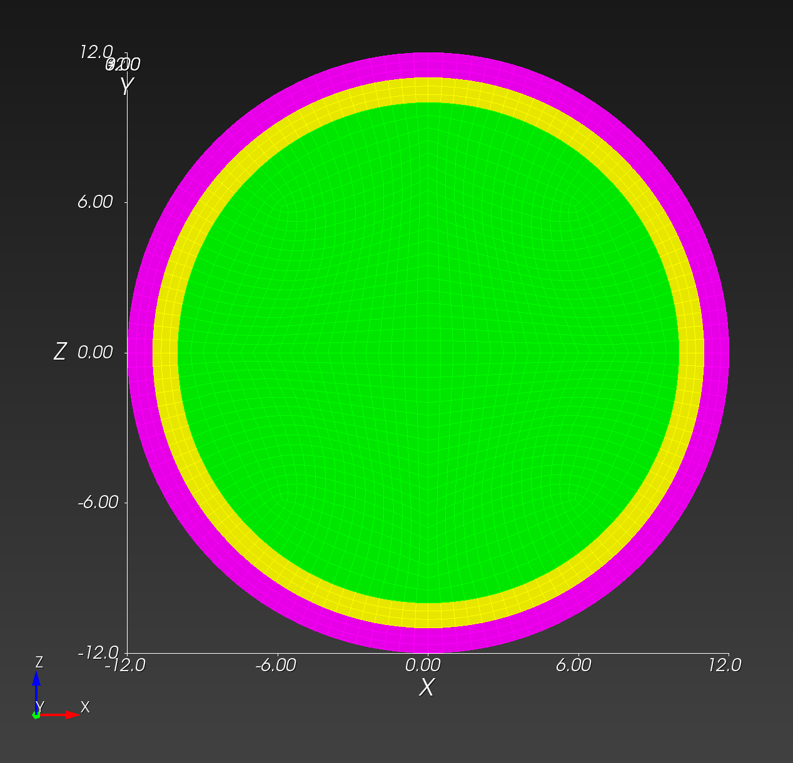
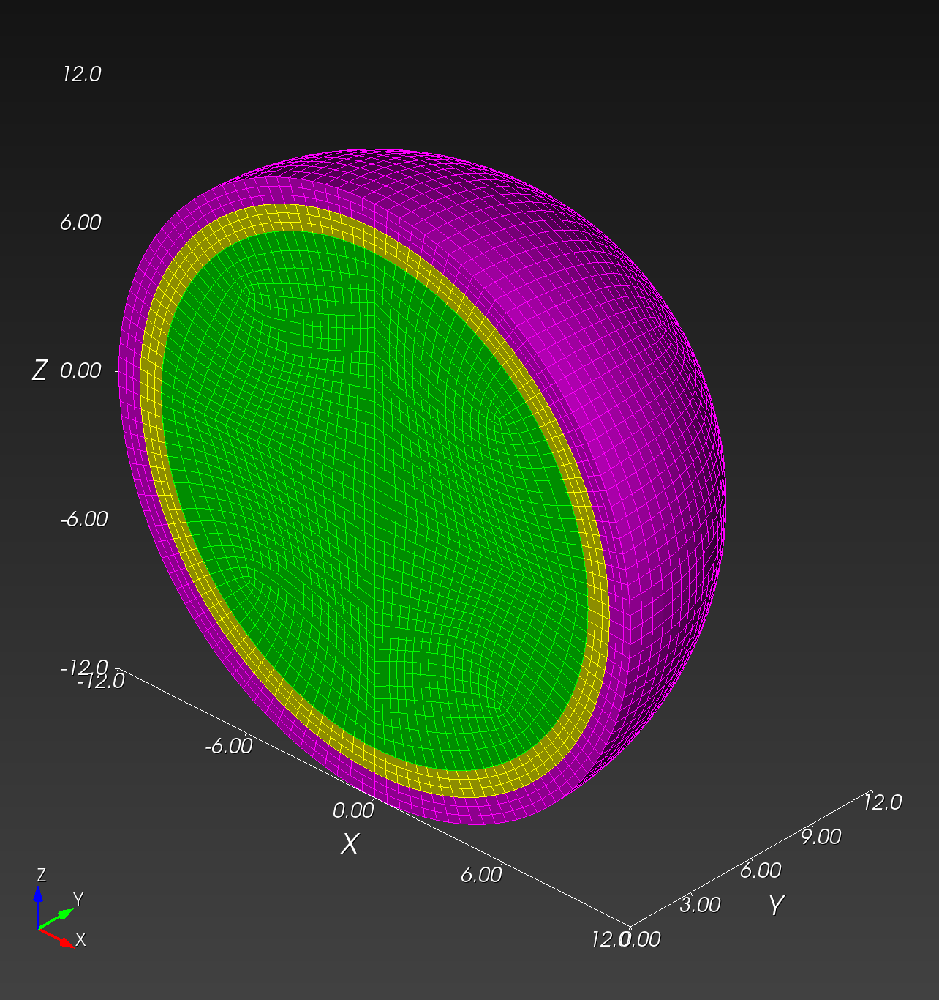

# Conforming Mesh

In this section, we develop a traditional conforming mesh, manually
constructed with Cubit.  We compare the results from the conforming
resolutions to the results obtained from the voxel mesh resolutions.

## Mesh Creation and Visualization

With [conforming_spheres.jou](conforming_spheres.jou) in Cubit, we create three conforming meshes to match the three voxel meshes of resolution 0.5, 0.25, and 0.1 cm (2 vox/cm, 4 vox/cm, and 10 vox/cm, respectively).

resolution | 2 vox/cm | 4 vox/cm | 10 vox/cm
---------- | -------- | -------- | ---------
midline   |   |  | 
isometric  |  |  | 
block 1 (green) #elements | 57,344 | 259,408 | 4,136,832
block 2 (yellow) #elements | 18,432 | 86,032 | 1,369,056
block 3 (magenta) #elements | 18,432 | 103,240 | 1,639,992
total #elements | 94,208 | 448,680 | 7,145,880

Copy from local to HPC:

```sh
# for example, manual copy from local to HPC
# macOS local finder, command+K to launch "Connect to Server"
# smb://cee/chovey
# copy [local]~/autotwin/automesh/book/analysis/sphere_with_shells/conf_0.5cm.g
# to
# [HPC]~/autotwin/ssm/geometry/sr2c/
```

We consider three simulations using the following three meshes (in the HPC ~/autotwin/ssm/geometry folder):

*  `sr2c/conf_0.5cm.g`
*  `sr3/spheres_reolution_3.exo`
*  `sr4/spheres_reolution_4.exo`

## Tracers

To come.

## Simulation

We created three input decks:

* [sr2c.i](https://github.com/autotwin/ssm/blob/main/input/sr2c/sr2c.i) (for mesh conf_0.5cm.g)
* sr3c.i (for mesh conf_0.25cm.g)
* sr4c.i (for mesh conf_0.1cm.g)

## Results

Compute time:

item | sim | T_sim (ms) | HPC | #proc | cpu time (hh:mm)
:---: | :---: | :---: | :---: | :---: | :---:
0 | sr2c.i | 20 | gho | 160 | less than 1 min
1 | sr3.i | 20 | att | 160 | 00:04
2 | sr4.i | 20 | att | 160 | 03:48