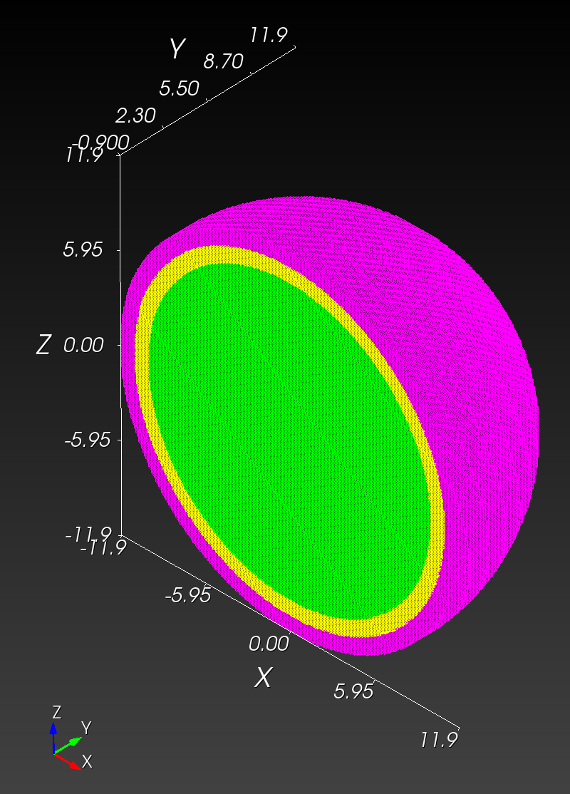

# Timing - `automesh`

Build the latest release version of `automesh`.

```sh
cd ~/autotwin/automesh
cargo build --release
...
   Compiling automesh v0.2.8 (/Users/chovey/autotwin/automesh)
    Finished `release` profile [optimized] target(s) in 2m 59s
```

Set up.

```sh
alias automesh='/Users/chovey/autotwin/automesh/target/release/automesh'
cd ~/autotwin/automesh/book/analysis/sphere_with_shells/
```

### Mesh Creation

Use `automesh` to convert the segmentations into finite element meshes.

**Remark:** Instead of the Abaqus output format (`.inp`), we use the Exodus II output format (`.exo`), which can result in faster mesh creation and smaller file sizes due to compression. The Exodus output files are created with the following,

```sh
automesh mesh -i spheres_resolution_1.npy \
-o spheres_resolution_1.exo \
-x 24 -y 24 -z 24 \
--remove 0 \
--xtranslate -12 --ytranslate -12 --ztranslate -12
```

```sh
    automesh 0.2.8
     Reading spheres_resolution_1.npy
        Done 556.958µs
     Meshing spheres_resolution_1.exo [xtranslate: -12, ytranslate: -12, ztranslate: -12] 
        Done 841.084µs
     Writing spheres_resolution_1.exo
        Done 17.795292ms
```

```sh
automesh mesh -i spheres_resolution_2.npy \
-o spheres_resolution_2.exo \
-x 48 -y 48 -z 48 \
--remove 0 \
--xscale 0.5 --yscale 0.5 --zscale 0.5 \
--xtranslate -12 --ytranslate -12 --ztranslate -12
```

```sh
    automesh 0.2.8
     Reading spheres_resolution_2.npy
        Done 7.280417ms
     Meshing spheres_resolution_2.exo [xscale: 0.5, yscale: 0.5, zscale: 0.5, xtranslate: -12, ytranslate: -12, ztranslate: -12] 
        Done 4.497209ms
     Writing spheres_resolution_2.exo
        Done 26.157584ms
```

```sh
automesh mesh -i spheres_resolution_3.npy \
-o spheres_resolution_3.exo \
-x 96 -y 96 -z 96 \
--remove 0 \
--xscale 0.25 --yscale 0.25 --zscale 0.25 \
--xtranslate -12 --ytranslate -12 --ztranslate -12
```

```sh
    automesh 0.2.8
     Reading spheres_resolution_3.npy
        Done 11.56025ms
     Meshing spheres_resolution_3.exo [xscale: 0.25, yscale: 0.25, zscale: 0.25, xtranslate: -12, ytranslate: -12, ztranslate: -12] 
        Done 37.329166ms
     Writing spheres_resolution_3.exo
        Done 71.462542ms
```

```sh
automesh mesh -i spheres_resolution_4.npy \
-o spheres_resolution_4.exo \
-x 240 -y 240 -z 240 \
--remove 0 \
--xscale 0.1 --yscale 0.1 --zscale 0.1 \
--xtranslate -12 --ytranslate -12 --ztranslate -12
```

```sh
    automesh 0.2.8
     Reading spheres_resolution_4.npy
        Done 13.226083ms
     Meshing spheres_resolution_4.exo [xscale: 0.1, yscale: 0.1, zscale: 0.1, xtranslate: -12, ytranslate: -12, ztranslate: -12] 
        Done 620.524208ms
     Writing spheres_resolution_4.exo
        Done 930.410584ms
```

## Visualization

Cubit is used for the visualizations with the following recipe:

```sh
reset
cd "/Users/chovey/autotwin/automesh/book/analysis/sphere_with_shells"

import mesh "spheres_resolution_1.exo" lite

graphics scale on

graphics clip off
view iso
graphics clip on plane location 0 -1.0 0 direction 0 1 0
view up 0 0 1
view from 100 -100 100

graphics clip manipulation off

view bottom
```

resolution | 1 vox/cm | 2 vox/cm | 4 vox/cm | 10 vox/cm
---------- | -------- | -------- | -------- | ---------
midline   |  |  |  | 
isometric  |  |  |  | 
