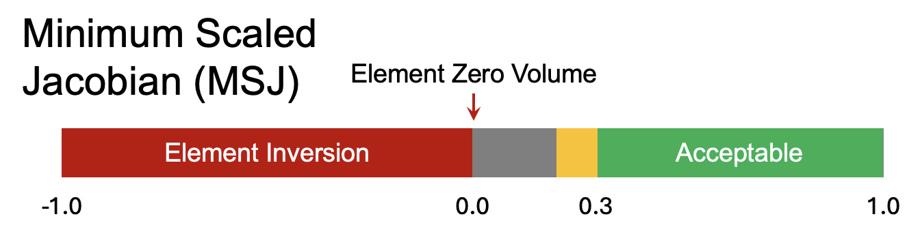
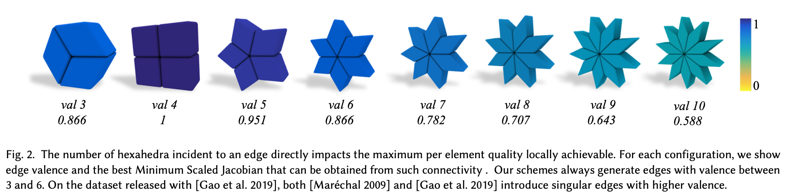
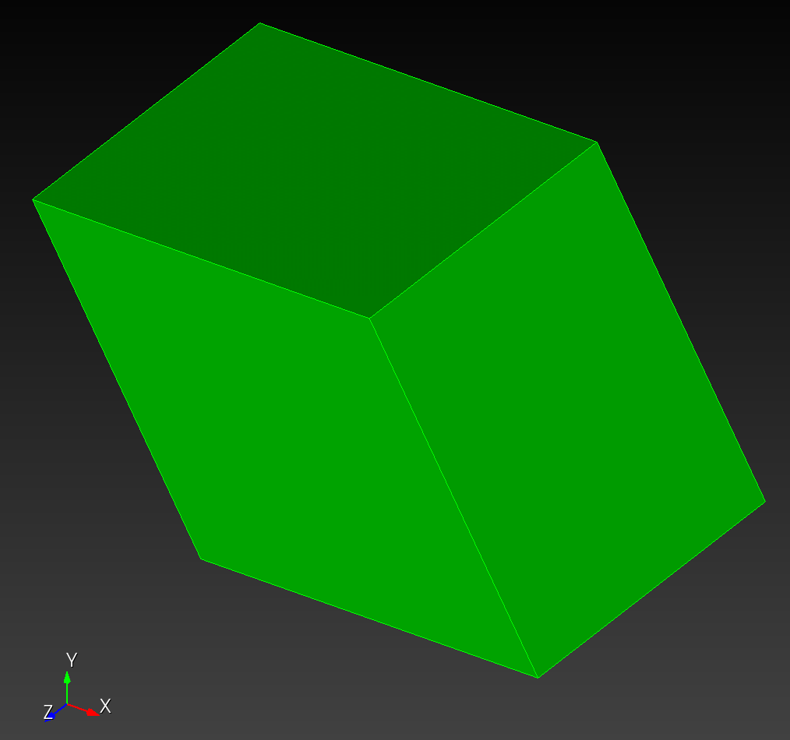
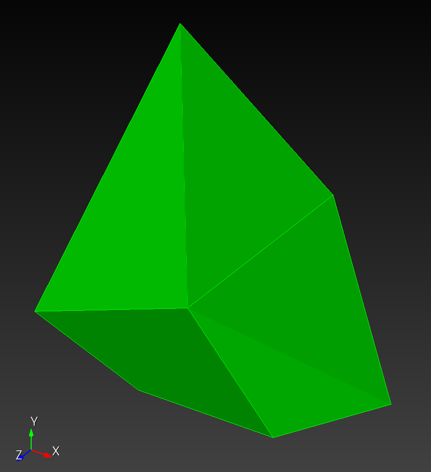
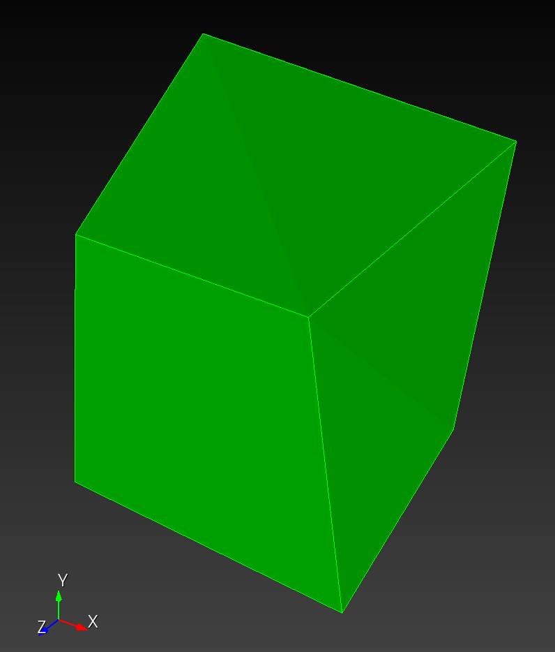
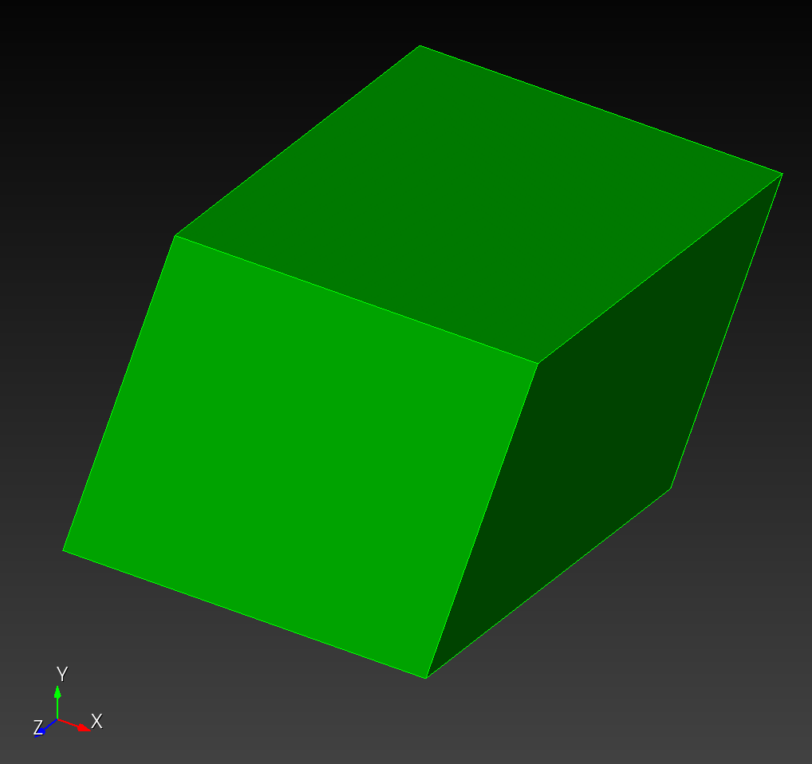
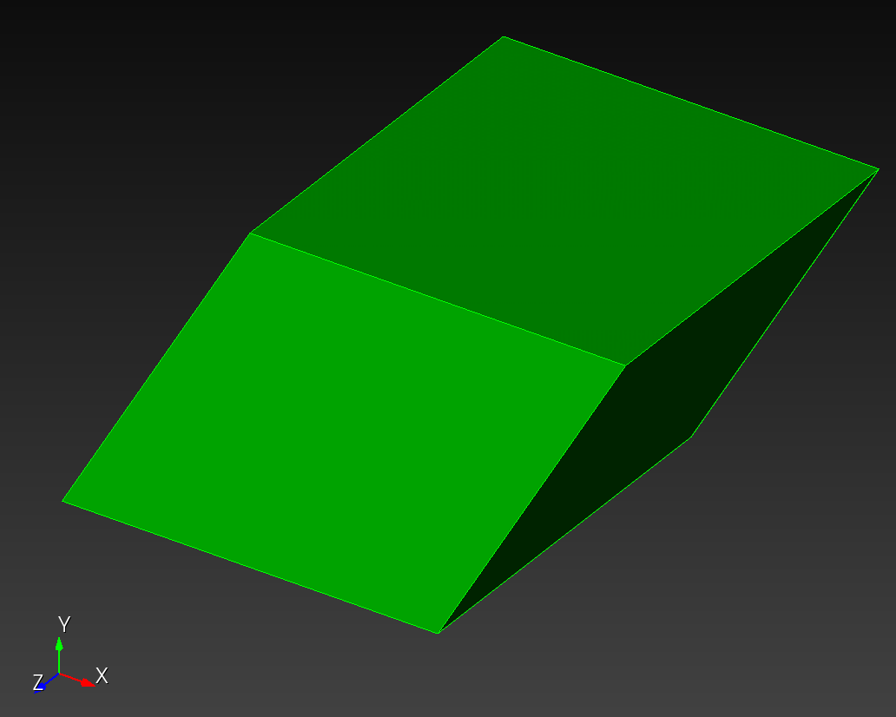
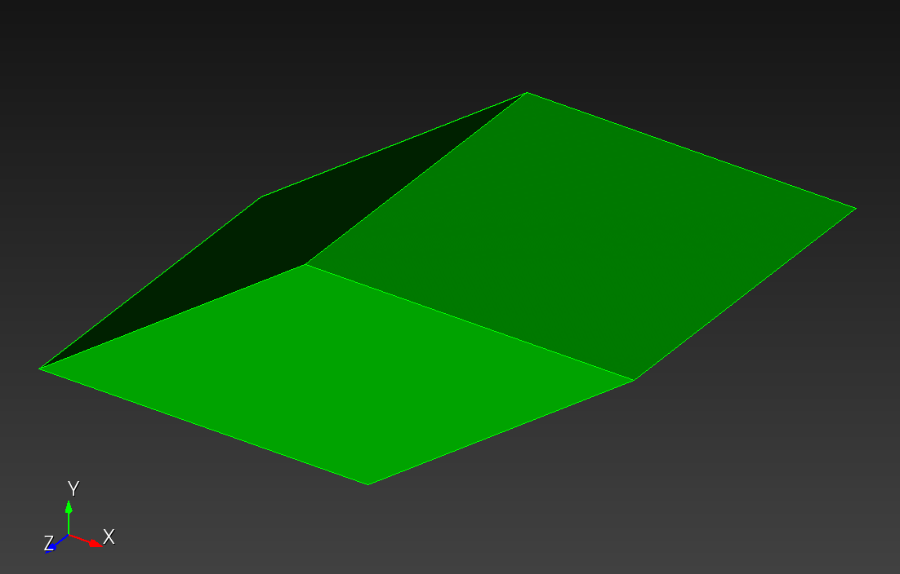
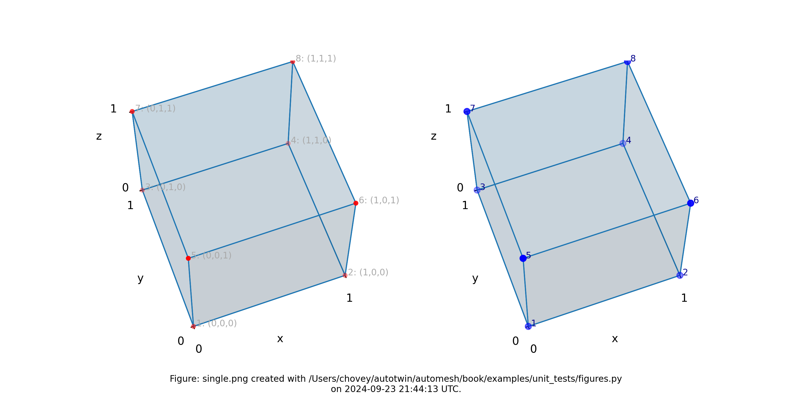

# Metrics

```sh
automesh metrics --help
<!-- cmdrun automesh metrics --help -->
```

## Hexahedral Metrics

`automesh` implements the following hexahedral element quality metrics defined in the Verdict report.[^Knupp_2006]

* Maximum edge ratio ${\rm ER}_{\max}$
* Minium scaled Jacobian ${\rm SJ}_{\min}$
* Maximum skew
* Element volume

A brief description of each metric follows.

### Maximum Edge Ratio

* ${\rm ER}_{\max}$ measures the ratio of the longest edge to the shortest edge in a mesh element.
* A ratio of 1.0 indicates perfect element quality, whereas a very large ratio indicates bad element quality.
* Knupp *et al.*[^Knupp_2006] (page 87) indicate an acceptable range of `[1.0, 1.3]`.

### Minimum Scaled Jacobian

* ${\rm SJ}_{\min}$ evaluates the determinant of the Jacobian matrix at each of the corners nodes, normalized by the corresponding edge lengths, and returns the minimum value of those evaluations.
* Knupp *et al.*[^Knupp_2006] (page 92) indicate an acceptable range of `[0.5, 1.0]`, though in practice, minimum values as low as `0.2` and `0.3` are often used.



Figure. Illustrate of minimum scaled Jacobian[^Hovey_2023] with acceptable range for quality occurring in `[0.3, 1.0]`.

### Maximum Skew

* Skew measures how much an element deviates from being a regular shape (e.g., in 3D a cube; in 2D a square or equilateral triangle). A skew value of 0 indicates a perfectly regular shape, while higher values indicate increasing levels of distortion.
* Knupp *et al.*[^Knupp_2006] (page 97) indicate an acceptable range of `[0.0, 0.5]`.

### Element Volume

* Measures the volume of the element.

## Hexahedral Unit Tests

Inspired by Figure 2 of Livesu *et al.*[^Livesu_2021] reproduced here below



we examine several unit test singleton elements and their metrics.

valence | singleton | ${\rm ER}_{\max}$ | ${\rm SJ}_{\min}$ | ${\rm skew_{\max}}$ | volume
:---: | :---: | :---: | :---: | :---: | :---:
3           |         | 1.000000e0 (1.000)    | 8.660253e-1 (0.866)   | 5.000002e-1 (0.500)   | 8.660250e-1 (0.866)
3' (noised) |  | 1.292260e0 (2.325) ** *Cubit (aspect ratio): 1.292* | 1.917367e-1 (0.192)   | 6.797483e-1 (0.680)   | 1.247800e0  (1.248)
4           |         | 1.000000e0 (1.000)    | 1.000000e0  (1.000)   | 0.000000e0  (0.000)   | 1.000000e0  (1.000)
4' (noised) |  | 1.167884e0 (1.727) ** *Cubit (aspect ratio): 1.168* | 3.743932e-1 (0.374)   | 4.864936e-1 (0.486)   | 9.844008e-1 (0.984)
5           |         | 1.000000e0 (1.000)    | 9.510566e-1 (0.951)   | 3.090169e-1 (0.309)   | 9.510570e-1 (0.951)
6           |         | 1.000000e0 (1.000)    | 8.660253e-1 (0.866)   | 5.000002e-1 (0.500)   | 8.660250e-1 (0.866)
...         | ...                                   | ...                   | ...                   | ...                   | ...
10          |         | 1.000000e0 (1.000)    | 5.877851e-1 (0.588)   | 8.090171e-1 (0.809)   |  5.877850e-1 (0.588)

Figure: Maximum edge ratio, minimum scaled Jacobian, maximum skew, and volume.
Leading values are from `automesh`.
Values in parenthesis are results from [HexaLab](https://www.hexalab.net).[^Hexalab_2023]
Items with ** indicate where `automesh` and Cubit agree, but HexaLab disagrees.
  Cubit uses the term *Aspect Ratio* for Edge Ratio.

The connectivity for all elements:

```sh
1,    2,    4,    3,    5,    6,    8,    7
```

with prototype:



The element coordinates follow:

```sh
# 3
    1,      0.000000e0,      0.000000e0,      0.000000e0
    2,      1.000000e0,      0.000000e0,      0.000000e0
    3,     -0.500000e0,      0.866025e0,      0.000000e0
    4,      0.500000e0,      0.866025e0,      0.000000e0
    5,      0.000000e0,      0.000000e0,      1.000000e0
    6,      1.000000e0,      0.000000e0,      1.000000e0
    7,     -0.500000e0,      0.866025e0,      1.000000e0
    8,      0.500000e0,      0.866025e0,      1.000000e0

# 3'
    1,      0.110000e0,      0.120000e0,     -0.130000e0
    2,      1.200000e0,     -0.200000e0,      0.000000e0
    3,     -0.500000e0,      1.866025e0,     -0.200000e0
    4,      0.500000e0,      0.866025e0,     -0.400000e0
    5,      0.000000e0,      0.000000e0,      1.000000e0
    6,      1.000000e0,      0.000000e0,      1.000000e0
    7,     -0.500000e0,      0.600000e0,      1.400000e0
    8,      0.500000e0,      0.866025e0,      1.200000e0

# 4
    1,      0.000000e0,      0.000000e0,      0.000000e0
    2,      1.000000e0,      0.000000e0,      0.000000e0
    3,      0.000000e0,      1.000000e0,      0.000000e0
    4,      1.000000e0,      1.000000e0,      0.000000e0
    5,      0.000000e0,      0.000000e0,      1.000000e0
    6,      1.000000e0,      0.000000e0,      1.000000e0
    7,      0.000000e0,      1.000000e0,      1.000000e0
    8,      1.000000e0,      1.000000e0,      1.000000e0

# 4'
    1,      0.100000e0,      0.200000e0,      0.300000e0
    2,      1.200000e0,      0.300000e0,      0.400000e0
    3,     -0.200000e0,      1.200000e0,     -0.100000e0
    4,      1.030000e0,      1.102000e0,     -0.250000e0
    5,     -0.001000e0,     -0.021000e0,      1.002000e0
    6,      1.200000e0,     -0.100000e0,      1.100000e0
    7,      0.000000e0,      1.000000e0,      1.000000e0
    8,      1.010000e0,      1.020000e0,      1.030000e0

# 5
    1,      0.000000e0,      0.000000e0,      0.000000e0
    2,      1.000000e0,      0.000000e0,      0.000000e0
    3,      0.309017e0,      0.951057e0,      0.000000e0
    4,      1.309017e0,      0.951057e0,      0.000000e0
    5,      0.000000e0,      0.000000e0,      1.000000e0
    6,      1.000000e0,      0.000000e0,      1.000000e0
    7,      0.309017e0,      0.951057e0,      1.000000e0
    8,      1.309017e0,      0.951057e0,      1.000000e0

# 6
    1,      0.000000e0,      0.000000e0,      0.000000e0
    2,      1.000000e0,      0.000000e0,      0.000000e0
    3,      0.500000e0,      0.866025e0,      0.000000e0
    4,      1.500000e0,      0.866025e0,      0.000000e0
    5,      0.000000e0,      0.000000e0,      1.000000e0
    6,      1.000000e0,      0.000000e0,      1.000000e0
    7,      0.500000e0,      0.866025e0,      1.000000e0
    8,      1.500000e0,      0.866025e0,      1.000000e0

# 10
    1,      0.000000e0,      0.000000e0,      0.000000e0
    2,      1.000000e0,      0.000000e0,      0.000000e0
    3,      0.809017e0,      0.587785e0,      0.000000e0
    4,      1.809017e0,      0.587785e0,      0.000000e0
    5,      0.000000e0,      0.000000e0,      1.000000e0
    6,      1.000000e0,      0.000000e0,      1.000000e0
    7,      0.809017e0,      0.587785e0,      1.000000e0
    8,      1.809017e0,      0.587785e0,      1.000000e0
```

## Triangular Metrics

`automesh` implements the following triangular element quality metrics defined in the Verdict report.[^Knupp_2006]

* Maximum edge ratio ${\rm ER}_{\max}$
* Minium scaled Jacobian ${\rm SJ}_{\min}$
* Skew
* Element area

A brief description of each metric follows.

### Maximum Edge Ratio

* ${\rm ER}_{\max}$ measures the ratio of the longest edge to the shortest edge in a mesh element.
* A ratio of 1.0 indicates perfect element quality, whereas a very large ratio indicates bad element quality.
* Knupp *et al.*[^Knupp_2006] (page 26) indicate an acceptable range of `[1.0, 1.3]`.

### Minimum Scaled Jacobian

* ${\rm SJ}_{\min}$ evaluates the determinant of the Jacobian matrix at each of the corners nodes, normalized by the corresponding edge lengths, and returns the minimum value of those evaluations.
* Knupp *et al.*[^Knupp_2006] (page 29) indicate an acceptable range of `[0.5, 2*sqrt(3)/3]` $\approx$ `[0.5, 1.2]`.
* An equilateral triangle has a minimum scaled Jacobian of `1.0`.

### Skew

* Skew measures how much an element deviates from being a regular shape (e.g., in 3D a cube; in 2D a square or equilateral triangle). A skew value of 0 indicates a perfectly regular shape, while higher values indicate increasing levels of distortion.
* Knupp *et al.*[^Knupp_2006] does not give a definition of skew for triangles, so we provide our definition below.
For a triangle where $\theta_{\min}$ is the smallest angle of the triangle,

$$
{\rm skew} = \frac{60^{\circ} - \theta_{\min}}{60^{\circ}}
$$

* For an equilateral triangle, $\theta_{\min} = 60^{\circ}$ and ${\rm skew} = 0$.
* In the limit as $\theta_{\min} \rightarrow 0^{\circ}$ ${\rm skew} \rightarrow 1$.

### Element Area

* Measures the area of the element.

## Triangular Unit Tests

We start with `one_facet.stl`:

```sh
import stl "/Users/chovey/autotwin/automesh/tests/input/one_facet.stl" feature_angle 135.00 merge make_elements
surface 1 scheme trimesh minimum size 100
delete mesh surface 1  propagate
surface 1  scheme trimesh
mesh surface 1
quality tri all aspect ratio global draw mesh list detail
quality tri all scaled jacobian global draw mesh list detail
quality tri all element area global draw mesh list detail
```

We use the ABAQUS input file `single_valence_04_noise2.inp`.
We import the file into Cubit and create a triangular surface mesh:

```sh
import abaqus mesh geometry  "/Users/chovey/autotwin/automesh/tests/input/single_valence_04_noise2.inp" feature_angle 135.00
surface 1 scheme trimesh minimum size 100
surface 2 scheme trimesh minimum size 100
surface 3 scheme trimesh minimum size 100
surface 4 scheme trimesh minimum size 100
surface 5 scheme trimesh minimum size 100
# surface 6 scheme trimesh minimum size 100 # there is no side 6, two sides were merged
delete mesh surface all propagate
surface all scheme trimesh
mesh surface all
quality tri all aspect ratio global draw mesh list detail
quality tri all scaled jacobian global draw mesh list detail
quality tri all element area global draw mesh list detail
export stl ascii "/Users/chovey/autotwin/automesh/tests/input/single_valence_04_noise2.stl" mesh  overwrite
```

We collect these element qualities as follows:

file  |  `e`  | ${\rm ER}_{\max}$ | ${\rm SJ}_{\min}$ | ${\rm skew}$  | area | $\theta_{\min}$ (deg)
:---: | :---: | :---: | :---: | :---: | :---: | :---:
`A`   |   1   | 1.507 [1.507] | xxx (8.165e-01) | xxx | xxx (5.000e-01) | yyy (45.0)
`B`   |   1   | 1.550 [1.550] | xxx (8.978e-01) | xxx | xxx (4.244e-01) |
`B`   |   2   | 1.787 [1.787] | xxx (8.314e-01) | xxx | xxx (4.429e-01) |
`B`   |   3   | 1.915 [1.915] | xxx (4.262e-01) | xxx | xxx (3.419e-01) |
`B`   |   4   | 2.230 [2.230] | xxx (7.003e-01) | xxx | xxx (5.706e-01) |
`B`   |   5   | 1.623 [1.623] | xxx (8.800e-01) | xxx | xxx (6.679e-01) |
`B`   |   6   | 1.240 [1.240] | xxx (8.039e-01) | xxx | xxx (5.158e-01) |
`B`   |   7   | 1.385 [1.385] | xxx (7.190e-01) | xxx | xxx (6.482e-01) |
`B`   |   8   | 1.606 [1.606] | xxx (8.061e-01) | xxx | xxx (7.041e-01) |
`B`   |   9   | 1.429 [1.429] | xxx (7.606e-01) | xxx | xxx (6.095e-01) |
`B`   |  10   | 1.275 [1.275] | xxx (7.391e-01) | xxx | xxx (5.498e-01) |
`B`   |  11   | 1.436 [1.436] | xxx (6.392e-01) | xxx | xxx (5.695e-01) |
`B`   |  12   | 1.414 [1.141] | xxx (5.947e-01) | xxx | xxx (4.022e-01) |

Figure: Maximum edge ratio, minimum scaled Jacobian, skew, and area.
Leading values are from `automesh`.
Values in (parenthesis) are results from Cubit.
Valies in [brackets] are from an independent Python calcuation.
Cubit uses the term *Aspect Ratio* but it is **not the same** as Edge Ratio.
File `A` is `one_facet.stl`.
File `B` is `single_valence_04_noise2.inp`.
`e` is the element number in the mesh.

## References

[^Knupp_2006]: Knupp PM, Ernst CD, Thompson DC, Stimpson CJ, Pebay PP. The verdict geometric quality library. SAND2007-1751. Sandia National Laboratories (SNL), Albuquerque, NM, and Livermore, CA (United States); 2006 Mar 1. [link](https://www.osti.gov/servlets/purl/901967)

[^Hovey_2023]: Hovey CB. Naval Force Health Protection Program Review 2023 Presentation Slides. SAND2023-05198PE. Sandia National Lab.(SNL-NM), Albuquerque, NM (United States); 2023 Jun 26.  [link](https://1drv.ms/p/s!ApVSeeLlvsE8g9UPEHLqBCVxT2jfCQ?e=iEAcgr)

[^Livesu_2021]: Livesu M, Pitzalis L, Cherchi G. Optimal dual schemes for adaptive grid based hexmeshing. ACM Transactions on Graphics (TOG). 2021 Dec 6;41(2):1-4. [link](https://dl.acm.org/doi/pdf/10.1145/3494456)

[^Hexalab_2023]: Bracci M, Tarini M, Pietroni N, Livesu M, Cignoni P. HexaLab.net: An online viewer for hexahedral meshes. Computer-Aided Design. 2019 May 1;110:24-36. [link](https://doi.org/10.1016/j.cad.2018.12.003)
