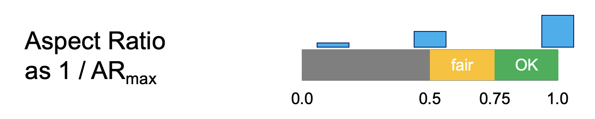

# Metrics

```sh
automesh metrics --help
<!-- cmdrun automesh metrics --help -->
```

## Input/Output File Types

```sh
inp -> csv
```

The element quality definitions are defined in the Verdict report.[^Knupp_2006].
A brief description of each metric implemented in `automesh` follows.

### Maximum Aspect Ratio

* Measures the ratio of the longest edge to the shortest edge in a mesh element.
* A ratio of 1.0 indicates perfect element quality, whereas a very large aspect ratio indicates poor element quality.
* Knupp *et al.*[^Knupp_2006] (page 87), indicate an acceptable range of `[1.0, 1.3]`.

> Remark: Because maximum aspect ratio can be unbounded above, we prefer to report the **inverse** of the maximum aspect ratio, which is mathematically the same as the **minimum** aspect ratio ${\rm AR}_{\min}$.  This quantity is bounded by `(0.0, 1.0]`.



Figure: Illustration of **minimum** aspect ratio[^Hovey_2023] with the acceptable range for quality occurring in `[0.75, 1.0]` (approximately the inverse of the `[1.0, 1.3]` accepatable range for *maximum* aspect ratio, mentioned above).

### Minimum Scaled Jacobian


Figure. Illustrate of minimum scaled Jacobian[^Hovey_2023] with acceptable range for quality ocurring in `[0.3, 1.0]`.

### Maximum Skew

* Measures how much an element deviates from being a regular shape (e.g., in 3D a cube; in 2D a square or equilateral triangle). A maximum skew value of 0 indicates a perfectly regular shape, while higher values indicate increasing levels of distortion.

## Unit Tests

Inspired by Livesu *et al.*[^Livesu_2021], Figure 2, reproduced here below:


valence | singleton | ${\rm AR}_{\min}$ | ${\rm SJ}_{\min}$ | ${\rm skew}_{\max}$
:---: | :---: | :---: | :---: | :---:
3 |  | 1.0 (9.999997e-1) | 0.866 (1.0) | 0.5 (0.0)
3' (noised) |  | 1.29 (7.738382e-1) | 0.192 (4.088211e-1) | 0.680 (6.294436e-2)
4 |  | 1.0 (1.0) | 1.0 (1.0) | 0.0 (0.0)
4' (noised) |  | 1.17 (8.562497e-1) | 0.374 (3.785657e-1) | 0.486 (3.992235e-2)
5 |  | 1.0 (9.999995e-1) | 0.951 (1.0) | 0.309 (0.0)
6 |  | 1.0 (9.999997e-1) | 0.866 (1.0) | 0.5 (0.0)
... | ... | ... | ... | ...
10 |  | 1.0 (9.999999e-1) | 0.588 (1.0) | 0.809 (0.0)

Figure: Maximum aspect ratio (MAR), minimum scaled Jacobian (MSJ), and maximum skew.  Values in (xx) are as repoted in AM as of 2025-01-14-1621-EST.  Values preceeding the (xx) values are from Cubit.

## References

[^Hovey_2023]: Hovey CB. Naval Force Health Protection Program Review 2023 Presentation Slides. SAND2023-05198PE. Sandia National Lab.(SNL-NM), Albuquerque, NM (United States); 2023 Jun 26.  [link](https://1drv.ms/p/s!ApVSeeLlvsE8g9UPEHLqBCVxT2jfCQ?e=iEAcgr)

[^Knupp_2006]: Knupp PM, Ernst CD, Thompson DC, Stimpson CJ, Pebay PP. The verdict geometric quality library. SAND2007-1751. Sandia National Laboratories (SNL), Albuquerque, NM, and Livermore, CA (United States); 2006 Mar 1. [link](https://www.osti.gov/servlets/purl/901967)

[^Livesu_2021]: Livesu M, Pitzalis L, Cherchi G. Optimal dual schemes for adaptive grid based hexmeshing. ACM Transactions on Graphics (TOG). 2021 Dec 6;41(2):1-4. [link](https://dl.acm.org/doi/pdf/10.1145/3494456)
