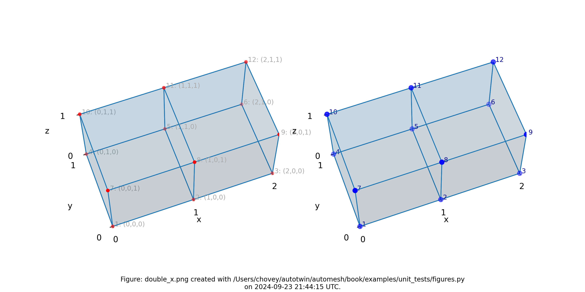
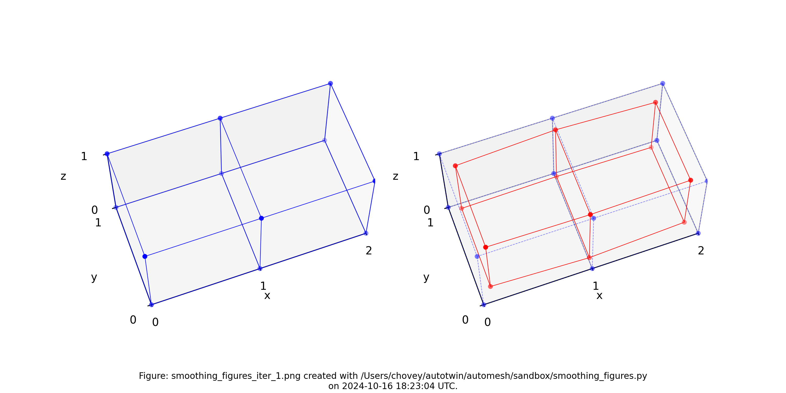
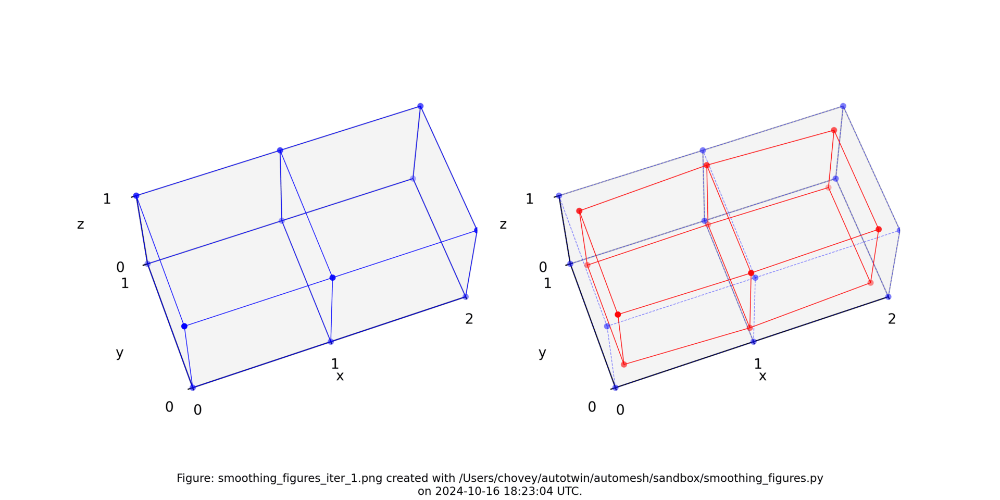
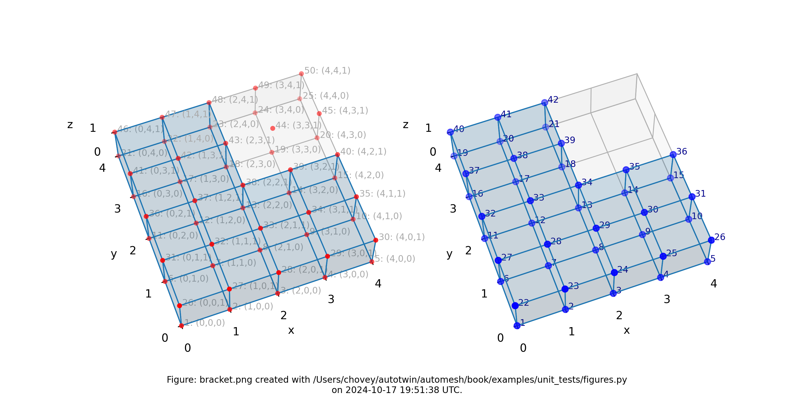

# Smoothing

## Double X

We examine the most basic type of smoothing, Laplace smoothing, $\lambda = 0.3$,
without hierarchical control, with the [Double X](../unit_tests/README.md#double-x) example.



Figure: The **Double X** two-element example.

Table. The *neighborhoods table*. A node, with its neighbors, is considered a single neighborhood.  The table has twelve neighborhoods.

node | node neighbors
:---: | :---:
1  | 2, 4, 7
2  | 1, 3, 5, 8
3  | 2, 6, 9
4  | 1, 5, 10
5  | 2, 4, 6, 11
6  | 3, 5, 12
7  | 1, 8, 10
8  | 2, 7, 9, 11
9  | 3, 8, 12
10 | 4, 7, 11
11 | 5, 8, 10, 12
12 | 6, 9, 11

### Hierarchy

Following is a test where all nodes are `BOUNDARY` from the [`Hierarchy`](../../theory/smoothing.md#the-hierarchy-enum) enum.

```python
node_smoothing_categories: Hierarchy = (
    Hierarchy.BOUNDARY,
    Hierarchy.BOUNDARY,
    Hierarchy.BOUNDARY,
    Hierarchy.BOUNDARY,
    Hierarchy.BOUNDARY,
    Hierarchy.BOUNDARY,
    Hierarchy.BOUNDARY,
    Hierarchy.BOUNDARY,
    Hierarchy.BOUNDARY,
    Hierarchy.BOUNDARY,
    Hierarchy.BOUNDARY,
    Hierarchy.BOUNDARY,    
)
```

> Since there are no `INTERIOR` nodes nor `PRESCRIBED` nodes, the effect of hiearchical smoothing is nill, and the same effect would be observed were all nodes categorized as `INTERIOR` nodes.


#### Iteration `1`

Table: The smoothed configuration `(x, y, z)` after one iteration of Laplace smoothing.

node | `x` | `y` | `z`
:---: | :--- | :--- | :---
1 | 0.1 | 0.1 |0.1
2 | 1.0 | 0.075 | 0.075
3 | 1.9 | 0.1 |0.1
4 | 0.1 | 0.9 | 0.1
5 | 1.0 | 0.925 | 0.075
6 | 1.9 | 0.9 | 0.1
7 | 0.1 | 0.1 |0.9
8 | 1.0 | 0.075 | 0.925
9 | 1.9 | 0.1 | 0.9
10 | 0.1 | 0.9 | 0.9
11 | 1.0 | 0.925 | 0.925
12 | 1.9 | 0.9 | 0.9



Figure: Two element test problem (left) original configuration, (right) subject to two iterations of Laplace smoothing.

#### Iteration `2`

node | `x` | `y` | `z`
:---: | :--- | :--- | :---
1  | 0.19 | 0.1775 | 0.1775
2  | 1.0  | 0.1425 | 0.1425
3  | 1.81 | 0.1775 | 0.1775
4  | 0.19 | 0.8225 | 0.1775
5  | 1.0  | 0.8575 | 0.1425
6  | 1.81 | 0.8225 | 0.1775
7  | 0.19 | 0.1775 | 0.8225
8  | 1.0  | 0.1425 | 0.8575
9  | 1.81 | 0.1775 | 0.8225
10 | 0.19 | 0.8225 | 0.8225
11 | 1.0  | 0.8575 | 0.8575
12 | 1.81 | 0.8225 | 0.8225


Figure: Two element test problem (left) original configuration, (right) subject to two iterations of Laplace smoothing.

#### Iteration `100`

A known drawback of Laplace smoothing is that it can fail to preserve volumes.  In the limit, volumes get reduced to a point, as illustrated in the figure below.



Figure: Two element test problem (left) original configuration, (right) subject to `[1, 2, 3, 4, 5, 10, 20, 30, 100` iterations of Laplace smoothing.  Animation created with [Ezgif](https://ezgif.com/).

## Bracket

To begin to examine hiearchical control, we consider the [Bracket](../unit_tests/README.md#bracket) example.



Figure: The **Bracket** example.

### Laplace Smoothing without Hierarchical Control

As a baseline, let's examine what Laplace smoothing, $\lambda = 0.3$, *without* hierarchical control performs.


Figure: The `Bracket` test problem (left) original configuration, (right) subject to `[1, 2, 3, 4, 5, 10, 20, 30, 100`] iterations of Laplace smoothing.  Animation created with [Ezgif](https://ezgif.com/).

As an example, the nodal positions after 10 iterations are as follows:

node | `x` | `y` | `z`
:---: | :--- | :--- | :---
1 | 0.6603416706977089 | 0.6603416706977089 | 0.42058348557613
2 | 1.164014406316456 | 0.5922705223353653 | 0.4003570849733875
3 | 1.9979372129260855 | 0.5706936094999626 | 0.39548539946279243
4 | 2.8325693635137097 | 0.5703120664922405 | 0.40180333889841546
5 | 3.332396179530681 | 0.6196854057408008 | 0.4228468310236131
6 | 0.5922705223353653 | 1.164014406316456 | 0.4003570849733875
7 | 1.129330412354556 | 1.129330412354556 | 0.3779268501553354
8 | 1.986117815900869 | 1.100245269915641 | 0.3744217105825115
9 | 2.8536168286772536 | 1.0284532492877596 | 0.3839611664938703
10 | 3.3805688588919414 | 1.007196857251266 | 0.40846995582593837
11 | 0.5706936094999626 | 1.9979372129260853 | 0.39548539946279243
12 | 1.100245269915641 | 1.986117815900869 | 0.37442171058251145
13 | 1.9089262792820898 | 1.90892627928209 | 0.3766933485101331
14 | 2.816962753463538 | 1.5457873563122884 | 0.3970154773256839
15 | 3.3296020281899956 | 1.409074280806729 | 0.42165070606234384
16 | 0.5703120664922405 | 2.8325693635137097 | 0.40180333889841546
17 | 1.0284532492877596 | 2.8536168286772536 | 0.3839611664938703
18 | 1.5457873563122884 | 2.816962753463538 | 0.3970154773256839
19 | 0.6196854057408008 | 3.332396179530681 | 0.4228468310236131
20 | 1.007196857251266 | 3.3805688588919414 | 0.40846995582593837
21 | 1.409074280806729 | 3.3296020281899956 | 0.42165070606234384
22 | 0.6603416706977089 | 0.6603416706977089 | 0.5794165144238701
23 | 1.164014406316456 | 0.5922705223353653 | 0.5996429150266126
24 | 1.9979372129260853 | 0.5706936094999626 | 0.6045146005372077
25 | 2.8325693635137097 | 0.5703120664922404 | 0.5981966611015848
26 | 3.332396179530681 | 0.6196854057408007 | 0.5771531689763871
27 | 0.5922705223353654 | 1.164014406316456 | 0.5996429150266126
28 | 1.129330412354556 | 1.129330412354556 | 0.6220731498446648
29 | 1.986117815900869 | 1.100245269915641 | 0.6255782894174887
30 | 2.8536168286772536 | 1.0284532492877596 | 0.6160388335061299
31 | 3.3805688588919414 | 1.0071968572512657 | 0.5915300441740619
32 | 0.5706936094999626 | 1.9979372129260853 | 0.6045146005372076
33 | 1.100245269915641 | 1.986117815900869 | 0.6255782894174885
34 | 1.90892627928209 | 1.9089262792820898 | 0.623306651489867
35 | 2.816962753463538 | 1.5457873563122881 | 0.6029845226743162
36 | 3.3296020281899956 | 1.409074280806729 | 0.5783492939376563
37 | 0.5703120664922404 | 2.8325693635137097 | 0.5981966611015848
38 | 1.0284532492877596 | 2.8536168286772536 | 0.6160388335061298
39 | 1.5457873563122884 | 2.816962753463538 | 0.6029845226743162
40 | 0.6196854057408007 | 3.332396179530681 | 0.5771531689763871
41 | 1.0071968572512657 | 3.3805688588919414 | 0.5915300441740617
42 | 1.409074280806729 | 3.3296020281899956 | 0.5783492939376562

### Hierarchical Control

Next, we illustrate the how hierarchical control changes the smoothing.
Conside the `PRESCRIBED` hierarchical smoothing below:

```python
node_smoothing_categories: Hierarchy = (
    # hierarchy enum, node number, prescribed (x, y, z)
    2, #  1 -> (0, 0, 0)
    2, #  2 -> (1, 0, 0)
    2, #  3 -> (2, 0, 0)
    2, #  4 -> (3, 0, 0)
    2, #  5 -> (4, 0, 0)
    2, #  6 -> (0, 1, 0)
    1, #  7
    1, #  8
    1, #  9
    2, # 10 -> (4*cos(22.5 deg), 4*sin(22.5 deg), 0)
    2, # 11 -> *(0, 2, 0)
    1, # 12
    1, # 13
    1, # 14
    2, # 15 -> (4*cos(45 deg), 4*sin(45 deg), 0)
    2, # 16 -> (0, 3, 0)
    1, # 17
    1, # 18
    2, # 19 -> (0, 4, 0)
    2, # 20 -> (4*cos(67.5 deg), 4*sin(67.5 deg), 0)
    2, # 21 -> (4*cos(45 deg), 4*sin(45 deg), 0)
    # similarly repeated for the z=1 layer, nodes 22 to 42
)
```
