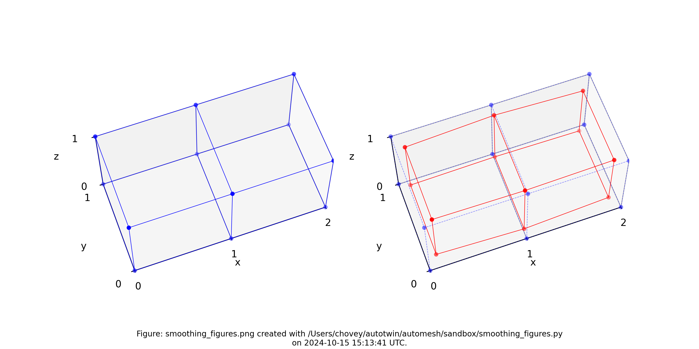

# Smoothing

All degrees of freedom in the mesh must be in one, and only one, of the
following *smoothing categories*:

* Prescribed
  * Homogeneous
  * Inhomogeneous
* Free
  * Exterior
  * Interface
  * Interior


Figure: Two element test problem.

Table: Nodal coordinates 1-12, with x, y, z, degrees of freedom.

node | `x` | `y` | `z` | `->` |  |  | dof
:---: | :---: | :---: | :---: | :---: | :---: | :---: | :---:
1  | 0.0 | 0.0 | 0.0 | | 1 | 2 | 3
2  | 1.0 | 0.0 | 0.0 | | 4 | 5 | 6
3  | 2.0 | 0.0 | 0.0 | | 7 | 8 | 9
4  | 0.0 | 1.0 | 0.0 | | 10 | 11 | 12
5  | 1.0 | 1.0 | 0.0 | | 13 | 14 | 15
6  | 2.0 | 1.0 | 0.0 | | 16 | 17 | 18
7  | 0.0 | 0.0 | 1.0 | | 19 | 20 | 21
8  | 1.0 | 0.0 | 1.0 | | 22 | 23 | 24
9  | 2.0 | 0.0 | 1.0 | | 25 | 26 | 27
10 | 0.0 | 1.0 | 1.0 | | 28 | 29 | 30
11 | 1.0 | 1.0 | 1.0 | | 31 | 32 | 33
12 | 2.0 | 1.0 | 1.0 | | 34 | 35 | 36

Table. The node neighbors.

node | neighbor node(s)
:---: | :---:
1  | 2, 4, 7
2  | 1, 3, 5, 8
3  | 2, 6, 9
4  | 1, 5, 10
5  | 2, 4, 6, 11
6  | 3, 5, 12
7  | 1, 8, 10
8  | 2, 7, 9, 11
9  | 3, 8, 12
10 | 4, 7, 11
11 | 5, 8, 10, 12
12 | 6, 9, 11

## All Free

Following is a test where all degrees of freedom are and
hierarchical smoothing is `OFF`.

```python
class DofType(Enum):
    """All degrees of freedom must belong to one, and only one, of the
    following smoothing categories.
    """

    PRESCRIBED_HOMOGENEOUS = 0
    PRESCRIBED_INHOMOGENEOUS = 1
    FREE_EXTERIOR = 2
    FREE_INTERFACE = 3
    FREE_INTERIOR = 4
```

```python
dofset: DofSet = (
    (4, 4, 4),
    (4, 4, 4),
    (4, 4, 4),
    (4, 4, 4),
    (4, 4, 4),
    (4, 4, 4),
    (4, 4, 4),
    (4, 4, 4),
    (4, 4, 4),
    (4, 4, 4),
    (4, 4, 4),
    (4, 4, 4),
)
```

Table: Smoothed configuration `(x', y', z')`.

node | `x` | `y` | `z`
:---: | :--- | :--- | :---
1 | 0.09999999999999999 | 0.09999999999999999 |0.09999999999999999
2 | 1.0 | 0.075 | 0.075
3 | 1.9 | 0.09999999999999999 |0.09999999999999999
4 | 0.09999999999999999 | 0.9 | 0.09999999999999999
5 | 1.0 | 0.925 | 0.075
6 | 1.9 | 0.9 | 0.09999999999999999
7 | 0.09999999999999999 | 0.09999999999999999 |0.9
8 | 1.0 | 0.075 | 0.925
9 | 1.9 | 0.09999999999999999 | 0.9
10 | 0.09999999999999999 | 0.9 | 0.9
11 | 1.0 | 0.925 | 0.925
12 | 1.9 | 0.9 | 0.9



Figure: Two element test problem subject to one iteration of Laplace smoothing.
