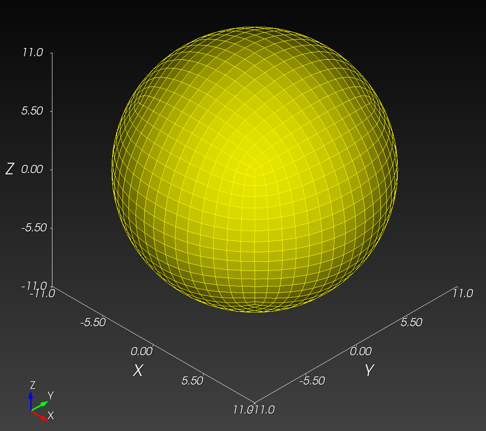
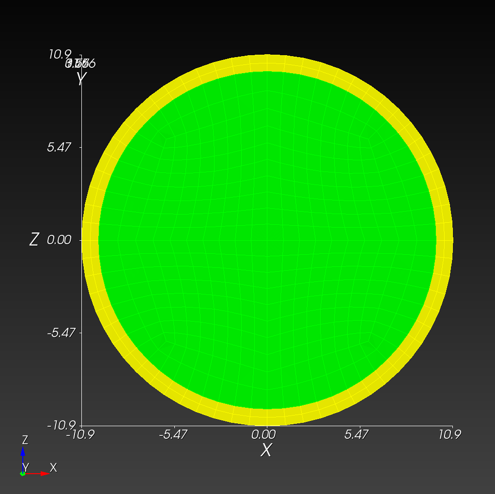
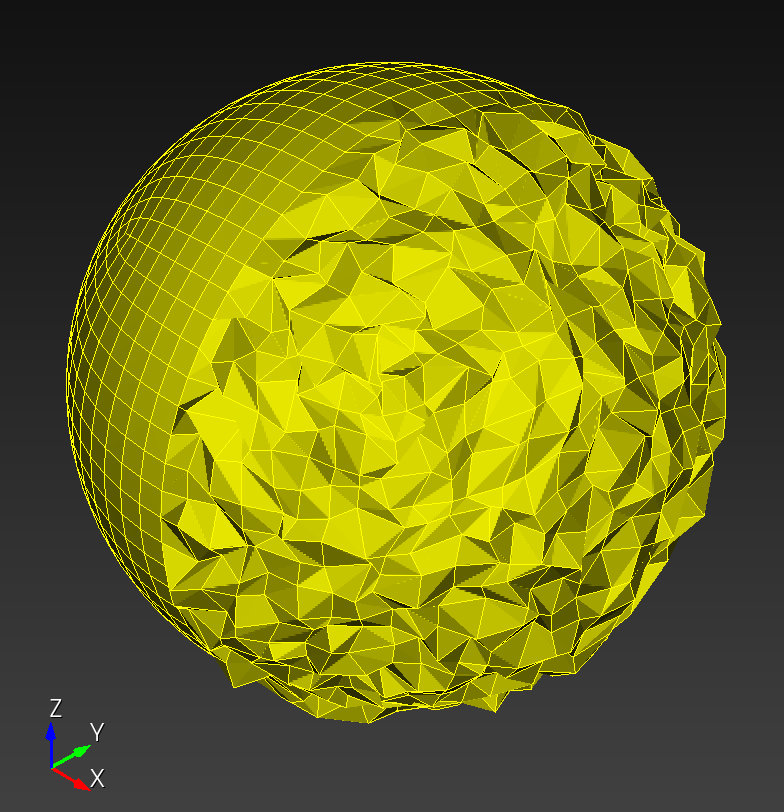
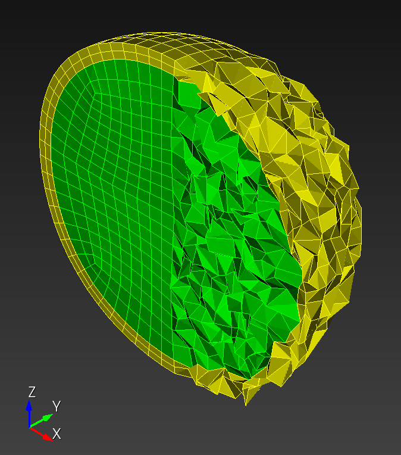
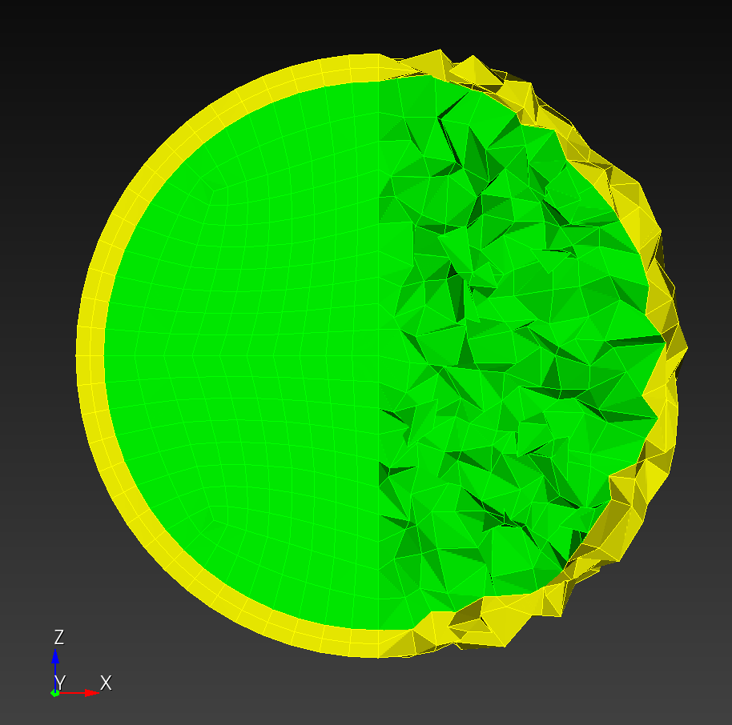

# Taubin Smoothing

* [`sphere.jou`](sphere.jou) Cubit journal file to create a two block spherical mesh
* `noise_augmentation.py` (see [code](#reference) below)

iso | iso midplane | `xz` midplane
:---: | :---: | :---:
 |  | 
 |  | 

## Taubin paper example


## Reference

```python
<!-- cmdrun cat noise_augmentation.py -->
```
