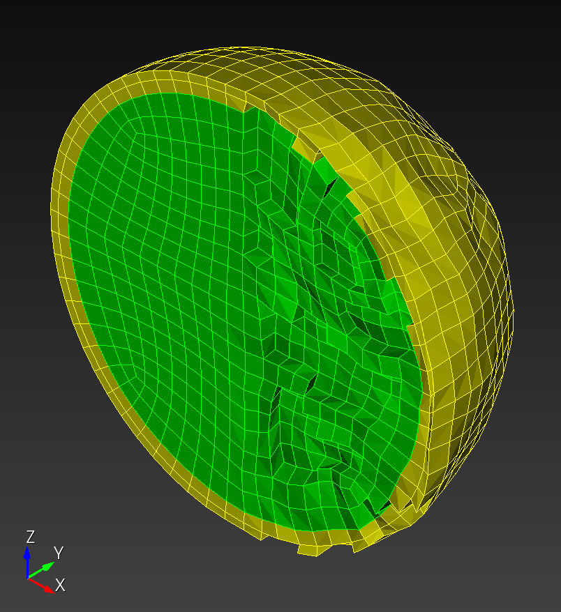
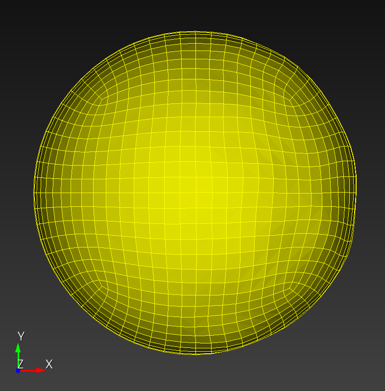
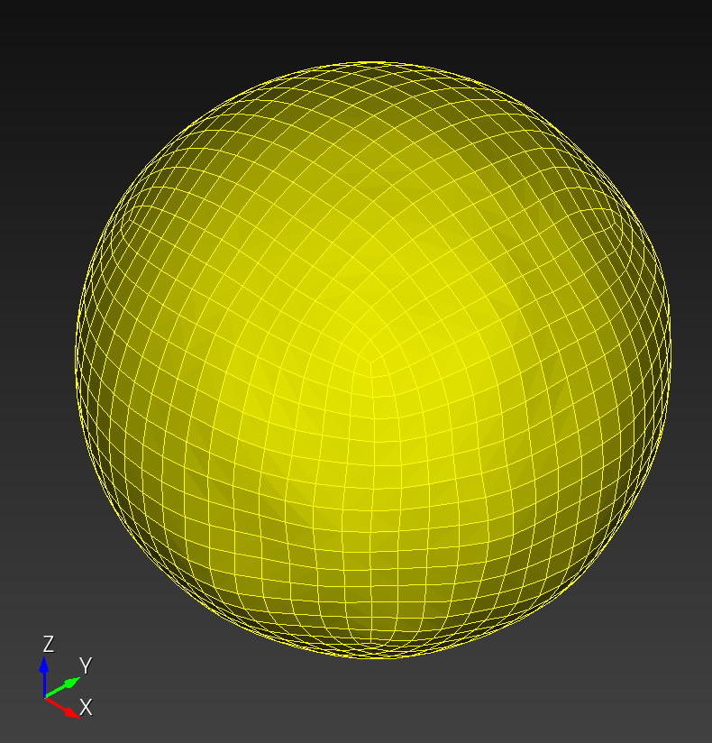
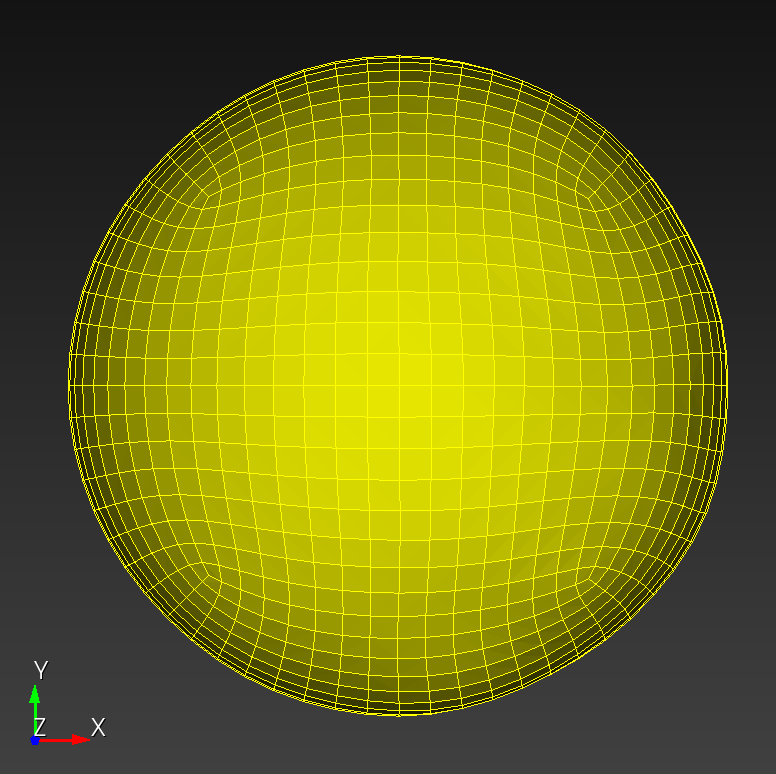
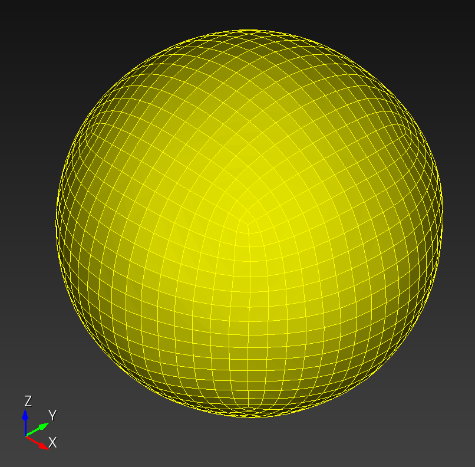
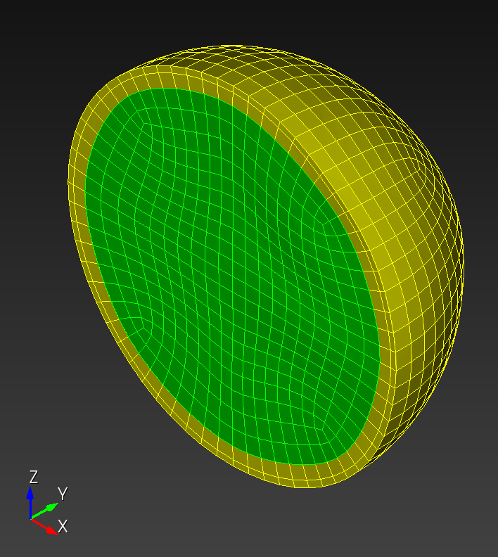

# Taubin Smoothing

We examine the Taubin smoothing algorithm on a sphere composed of hexahedral elements.
We created a two block (green inner volume, yellow outer volume) mesh in Cubit, then added normal noise to the hemisphere where the $x$ coordinate was positive.  We then applied Taubin smoothing to the noised model.

The Cubit and Python code used to generate the noised input file and figures is included [below](#source).

iso | iso midplane | `xz` midplane
:---: | :---: | :---:
 |  | 
 |  | 

Figure: (Top row) sphere original configuration.  (Bottom row) noised sphere configuration, with normal random nodal displacement of the coordinates where $x > 0$.

## Taubin example


Figure: Excerpt from Taubin[^Taubin_1995b], Figure 3, showing a surface mesh original configuration, and after 10, 50, and 200 steps.

## automesh

We compare our volumetric results to the surface mesh presented by Taubin.[^Taubin_1995b]  Taubin defined a *step* as either a "shrinking step" (deflating, smoothing $\lambda$ step) or an "un-shrinking step" (reinflating $\mu$ step).  

We have defined a single *iteration* as being composed of one smoothing step followed by one reinflation step.  So, for consistency with Taubin's example, which used 10, 50 and 200 steps, we examine our noised sphere after 5, 25, and 100 iterations.

The smoothing parameters used were the `autotwin` defaults,[^autotwin_defaults] the same as used in Taubin's Figure 3 example.

```sh
alias automesh='/Users/chovey/autotwin/automesh/target/release/automesh'
```

```sh
cd ~/autotwin/automesh/book/examples/smoothing/
```

```sh
automesh smooth -i sphere_res_1cm_noised.inp -o s5.exo -n 5
```

```sh
automesh smooth -i sphere_res_1cm_noised.inp -o s25.exo -n 25
```

```sh
automesh smooth -i sphere_res_1cm_noised.inp -o s100.exo -n 100
```

front | iso | `xz` midplane
:---: | :---: | :---:
 |  | 
 |  | 
 |  | 

Figure.  Smoothing results after 5 (top row), 25 (middle row), and 100 (bottom row) iterations.

The results demonstrate that our implementation of Taubin smoothing on volumetric meshes composed of hexahedral elements performs well.  All smoothing operations completed within 7.5 ms.  The noise in the $x > 0$ hemisphere was effectively removed, without volumetric shrinkage.  The $x < 0$ hemisphere did degradate from its original configuration.

## Source

### `sphere.jou`

```sh
<!-- cmdrun cat sphere.jou -->
```

### `noise_augmentation.py`

```python
<!-- cmdrun cat noise_augmentation.py -->
```

## References

[^Taubin_1995b]: Taubin G. A signal processing approach to fair surface design. In *Proceedings of the 22nd annual conference on Computer graphics and interactive techniques* 1995 Sep 15 (pp. 351-358). [paper](https://dl.acm.org/doi/pdf/10.1145/218380.218473)

[^autotwin_defaults]: `autotwin` default Taubin parameters: $k_{\rm{\tiny PB}} = 0.1$, $\lambda = 0.6307$ $\implies$ $\mu = −0.6732$.
