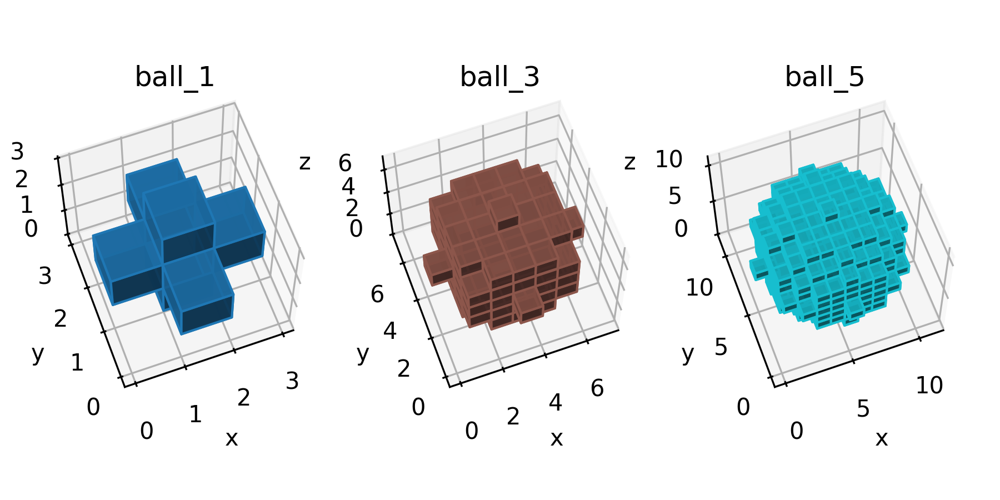

# Spheres

## Segmentation

Using [spheres.py](spheres.py), 

```python
<!-- cmdrun cat spheres.py -->
```

create very coarse spheres of varying
resolution (`radius=1`, `radius=3`, and `radius=5`), as shown below:



For the `radius=1` case, the underyling data structure appears as:

```python
spheres["ball_1"]

array([[[0, 0, 0],
        [0, 1, 0],
        [0, 0, 0]],

       [[0, 1, 0],
        [1, 1, 1],
        [0, 1, 0]],

       [[0, 0, 0],
        [0, 1, 0],
        [0, 0, 0]]], dtype=uint8)
```

For the `radius=3` case, the underyling data structure appears as:

```python
spheres["ball_3"]

array([[[0, 0, 0, 0, 0, 0, 0],
        [0, 0, 0, 0, 0, 0, 0],
        [0, 0, 0, 0, 0, 0, 0],
        [0, 0, 0, 1, 0, 0, 0],
        [0, 0, 0, 0, 0, 0, 0],
        [0, 0, 0, 0, 0, 0, 0],
        [0, 0, 0, 0, 0, 0, 0]],

       [[0, 0, 0, 0, 0, 0, 0],
        [0, 0, 1, 1, 1, 0, 0],
        [0, 1, 1, 1, 1, 1, 0],
        [0, 1, 1, 1, 1, 1, 0],
        [0, 1, 1, 1, 1, 1, 0],
        [0, 0, 1, 1, 1, 0, 0],
        [0, 0, 0, 0, 0, 0, 0]],

       [[0, 0, 0, 0, 0, 0, 0],
        [0, 1, 1, 1, 1, 1, 0],
        [0, 1, 1, 1, 1, 1, 0],
        [0, 1, 1, 1, 1, 1, 0],
        [0, 1, 1, 1, 1, 1, 0],
        [0, 1, 1, 1, 1, 1, 0],
        [0, 0, 0, 0, 0, 0, 0]],

       [[0, 0, 0, 1, 0, 0, 0],
        [0, 1, 1, 1, 1, 1, 0],
        [0, 1, 1, 1, 1, 1, 0],
        [1, 1, 1, 1, 1, 1, 1],
        [0, 1, 1, 1, 1, 1, 0],
        [0, 1, 1, 1, 1, 1, 0],
        [0, 0, 0, 1, 0, 0, 0]],

       [[0, 0, 0, 0, 0, 0, 0],
        [0, 1, 1, 1, 1, 1, 0],
        [0, 1, 1, 1, 1, 1, 0],
        [0, 1, 1, 1, 1, 1, 0],
        [0, 1, 1, 1, 1, 1, 0],
        [0, 1, 1, 1, 1, 1, 0],
        [0, 0, 0, 0, 0, 0, 0]],

       [[0, 0, 0, 0, 0, 0, 0],
        [0, 0, 1, 1, 1, 0, 0],
        [0, 1, 1, 1, 1, 1, 0],
        [0, 1, 1, 1, 1, 1, 0],
        [0, 1, 1, 1, 1, 1, 0],
        [0, 0, 1, 1, 1, 0, 0],
        [0, 0, 0, 0, 0, 0, 0]],

       [[0, 0, 0, 0, 0, 0, 0],
        [0, 0, 0, 0, 0, 0, 0],
        [0, 0, 0, 0, 0, 0, 0],
        [0, 0, 0, 1, 0, 0, 0],
        [0, 0, 0, 0, 0, 0, 0],
        [0, 0, 0, 0, 0, 0, 0],
        [0, 0, 0, 0, 0, 0, 0]]], dtype=uint8)
```

Because of the large size of `ball_5`, its data structure is not shown
here.

These data structures are saved to

* [spheres_ball_1_.npy](spheres_ball_1_.npy)
* [spheres_ball_3_.npy](spheres_ball_3_.npy)
* [spheres_ball_5_.npy](spheres_ball_5_.npy)

## Mesh

```sh
cargo run -- -i book/examples/spheres/spheres_ball_1_.npy -o book/examples/spheres/spheres_ball_1_.inp -x 3 -y 3 -z 3
```

```sh
cargo run -- -i book/examples/spheres/spheres_ball_3_.npy -o book/examples/spheres/spheres_ball_3_.inp -x 7 -y 7 -z 7
```

```sh
cargo run -- -i book/examples/spheres/spheres_ball_5_.npy -o book/examples/spheres/spheres_ball_5_.inp -x 11 -y 11 -z 11
```
