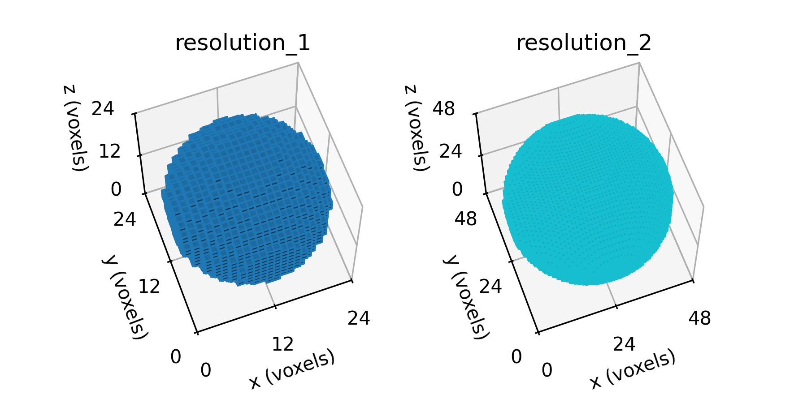
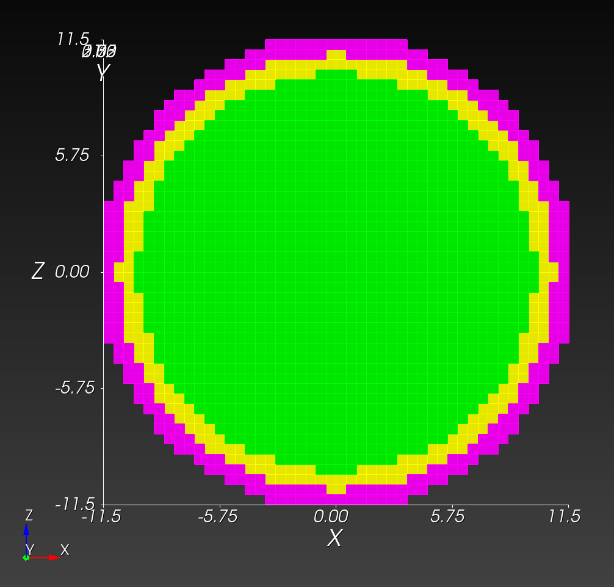
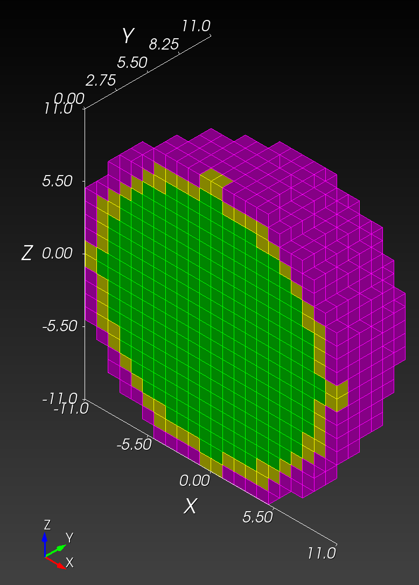
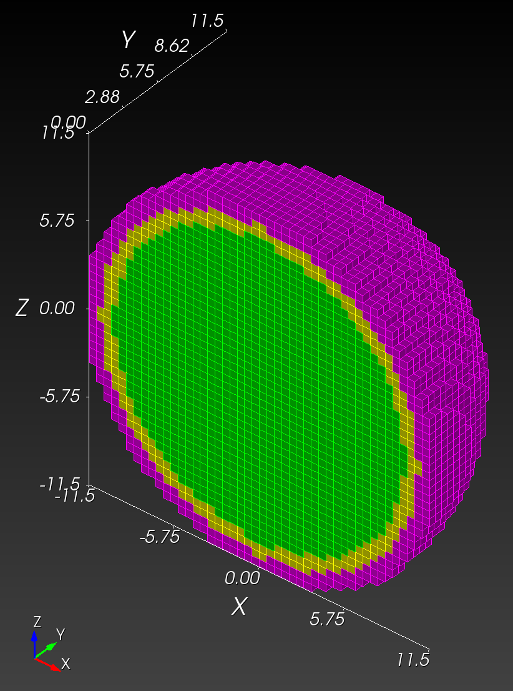
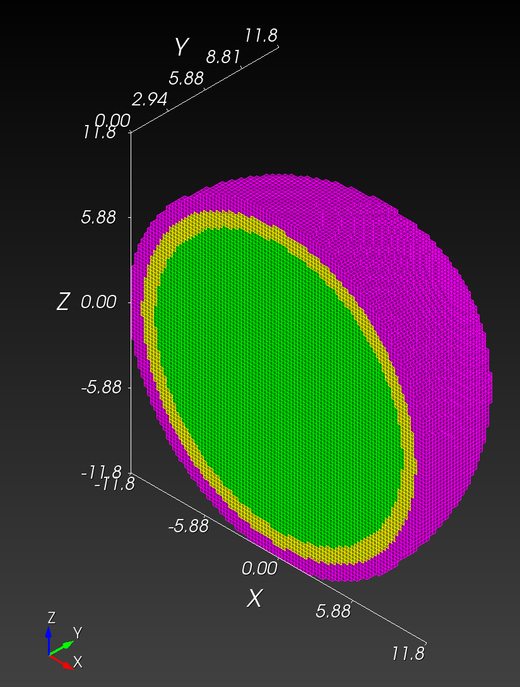

# Spheres - Continued

Use the fundamentals learned in the [previous example](../spheres/README.md) to create a more sophisticated example:  Concentric, high-resolution spheres consisting of three materials.

## Problem Statement

### Given

Given three concentric spheres of radius 10, 11, and 12 cm, as shown in the figure below,


Figure: Schematic cross-section of three concentric spheres of radius 10, 11, and 12 cm.  Grid spacing is 1 cm.

### Find

Use the following segmentation resolutions,

resolution (vox/cm) | element side length (cm) | `nelx` | # voxels
---: | :---: | ---: | ---:
1 | 1.0 | 24 | 13,824
2 | 0.5 | 48 | 110,592
4 | 0.25 | 96 | 884,736
10 | 0.1 | 240 | 13,824,000

with a cubic domain (`nelx = nely = nelz`),
to create finite element meshes.

## Solution

### Python Segmentation

Use [spheres_cont.py](spheres_cont.py) to create segmentations,

```python
<!-- cmdrun cat spheres_cont.py -->
```



Figure: Sphere segmentations at selected resolutions, shown in the voxel domain.
Because plotting large domains with [*Matplotlib*](https://matplotlib.org)
is slow, only the first two resolutions are shown.

### automesh

Use `automesh` to convert the segmentations into finite element meshes.

```sh
cd ~/autotwin/automesh/book/examples/spheres_cont/

automesh -i spheres_resolution_1.npy \
-o spheres_resolution_1.inp \
-x 24 -y 24 -z 24 \
--xtranslate -12 --ytranslate -12 --ztranslate -12

automesh -i spheres_resolution_2.npy \
-o spheres_resolution_2.inp \
-x 48 -y 48 -z 48 \
--xscale 0.5 --yscale 0.5 --yzscale 0.5 \
--xtranslate -12 --ytranslate -12 --ztranslate -12

automesh -i spheres_resolution_3.npy \
-o spheres_resolution_3.inp \
-x 96 -y 96 -z 96 \
--xscale 0.25 --yscale 0.25 --zscale 0.25 \
--xtranslate -12 --ytranslate -12 --ztranslate -12

automesh -i spheres_resolution_4.npy \
-o spheres_resolution_4.inp \
-x 240 -y 240 -z 240 \
--xscale 0.1 --yscale 0.1 --yzscale 0.1 \
--xtranslate -12 --ytranslate -12 --ztranslate -12
```

resolution | 1 vox/cm | 2 vox/cm | 4 vox/cm | 10 vox/cm
---------- | -------- | -------- | -------- | ---------
midline   |  |  |  |
isometric  |  |  |  |

Figure: Finite element meshes at various resolutions, shown with half-symmetric cut plane, in front view and isometric view.

Table: Summary of vital results with `automesh` version `0.1.7`.

resolution (vox/cm) | processing time | `.npy` file size | `.inp` file size (MB) | `.g` file size (MB)
---: | ---:     | ---:    | ---:  | ---:
1    | 3.24s | 14 kB   | 0.962 | 0.557
2    | 15.2s | 111 kB  |   8.5 |   4.5
4    | 13.5m | 885 kB  |  73.6 |  36.8
10   | xxx   | 13.8 MB |  xxxx | xxxxx

Cubit is used for the visualizations with the following recipe:

```sh
reset
import abaqus  "/Users/chovey/autotwin/automesh/book/examples/spheres_cont/spheres_resolution_1.inp"

set exodus netcdf4 off
set large exodus file on
export mesh "/Users/chovey/autotwin/automesh/book/examples/spheres_cont/spheres_resolution_1.g"  overwrite

reset
import mesh "/Users/chovey/autotwin/automesh/book/examples/spheres_cont/spheres_resolution_1.g" lite

graphics scale off
graphics scale on

graphics clip off
view iso
graphics clip on plane location 0 -1.0 0 direction 0 1 0
view up 0 0 1
view from 100 -100 100

graphics clip manipulation off

view bottom
```

## Comparison

Set up reference to the Sculpt binary,

```sh
alias sculpt='/Applications/Cubit-16.14/Cubit.app/Contents/MacOS/sculpt'
```

Convert `.npy` files to `.spn` files (see temporary development, https://github.com/hovey/rustschool/tree/main/npy2spn, to be migrated to `automesh` soon as part of the `clap` extension feature, https://github.com/autotwin/automesh/issues/117)
```sh
alias npy2spn='/Users/chovey/rustschool/npy2spn/target/release/npy2spn'
```

```sh
npy2spn -i spheres_resolution_1.npy -o spheres_resolution_1.spn
npy2spn -i spheres_resolution_2.npy -o spheres_resolution_2.spn
npy2spn -i spheres_resolution_3.npy -o spheres_resolution_3.spn
npy2spn -i spheres_resolution_4.npy -o spheres_resolution_4.spn
```

Run Sculpt

Test case with `letter_f_3d.spn` (renamed to `test_f.spn` for the test below):

```sh
sculpt --num_procs 1 --input_spn "test_f.spn" \
--nelx 4 --nely 5 --nelz 3 \
--spn_xyz_order 5 \
--stair 1
```

Elapsed Time            0.025113 sec. (0.000419 min.)

```sh
cd ~/autotwin/automesh/book/examples/spheres_cont/
```

```sh
sculpt --num_procs 1 --input_spn "spheres_resolution_1.spn" \
-x 24 -y 24 -z 24 \
--xtranslate -24 --ytranslate -24 --ztranslate -24 \
--spn_xyz_order 5 \
--stair 1
```

```sh
sculpt --num_procs 1 --input_spn "spheres_resolution_2.spn" \
-x 48 -y 48 -z 48 \
--xscale 0.5 --yscale 0.5 --zscale 0.5 \
--xtranslate -12 --ytranslate -12 --ztranslate -12
--spn_xyz_order 5
--stair 1
```

```sh
sculpt --num_procs 1 --input_spn "spheres_resolution_3.spn" \
-x 96 -y 96 -z 96
--xscale 0.25 --yscale 0.25 --zscale 0.25 \
--xtranslate -12 --ytranslate -12 --ztranslate -12 \
--spn_xyz_order 5 \
--stair 1
```

```sh
sculpt --num_procs 1 --input_spn "spheres_resolution_4.spn" \
-x 240 -y 240 -z 240 \
--xscale 0.1 --yscale 0.1 --zscale 0.1 \
--xtranslate -12 --ytranslate -12 --ztranslate -12 \
--spn_xyz_order 5 \
--stair 1
```

test | `nelx` | lines | time `automesh` | time Sculpt | speed up multiple
:---: | ---: | ---: | ---: | ---: | :---:
1 |  24 |     13,824 | 3.24s   |  1.101862s | 3x
2 |  48 |    110,592 | 15.2s   |  3.246166s | 4.7x
3 |  96 |    884,736 | 13.5m   | 24.414653s | 33x
4 | 240 | 13,824,000 | no data | 449.339395s | n/a
