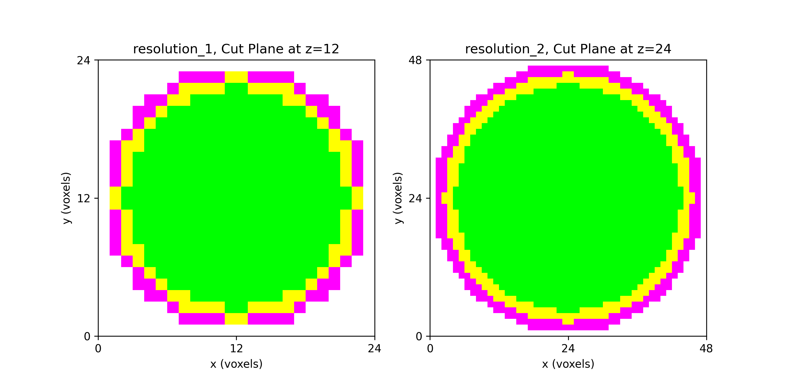

# Getting Started

*Work in progress*

We start with a segmentation, created in Python, that describes a sphere with
two concentric shells.  The segmentation encodes

* `0` for void (or background), shown in gray,
* `1` for the inner sphere, shown in green,
* `2` for the intermediate shell, shown in yellow, and
* `3` for the outer shell, shown in magenta.

A very coarse (`7 x 7 x 7`) segmentation, taken as a midline cut plane
may appear as

    <!--row 1-->
    
0

    
0

    
0

    
3

    
0

    
0

    
0

    <!--row 2-->
    
0

    
0

    
3

    
2

    
3

    
0

    
0

    <!--row 3-->
    
0

    
3

    
2

    
1

    
2

    
3

    
0

    <!--row 4-->
    
3

    
2

    
1

    
1

    
1

    
2

    
3

    <!--row 5-->
    
0

    
3

    
2

    
1

    
2

    
3

    
0

    <!--row 6-->
    
0

    
0

    
3

    
2

    
3

    
0

    
0

    <!--row 7-->
    
0

    
0

    
0

    
3

    
0

    
0

    
0

This very coarse image, at two higher resolutions of (`24 x 24 x 24`) and
(`48 x 48 x 48`) is shown below:

