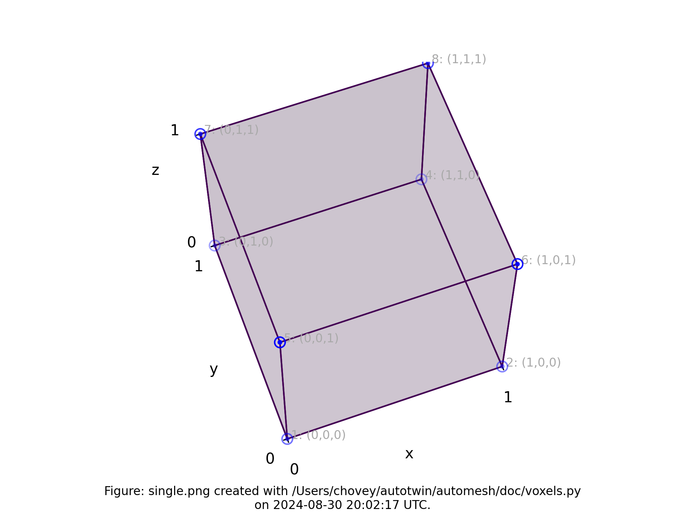
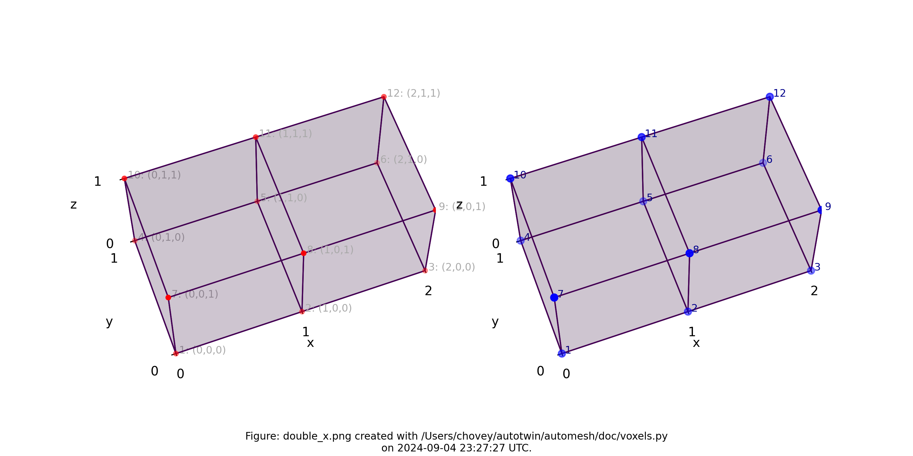
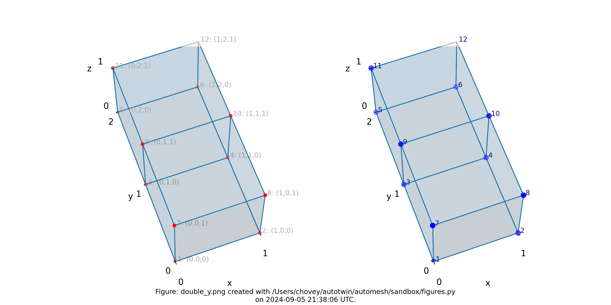
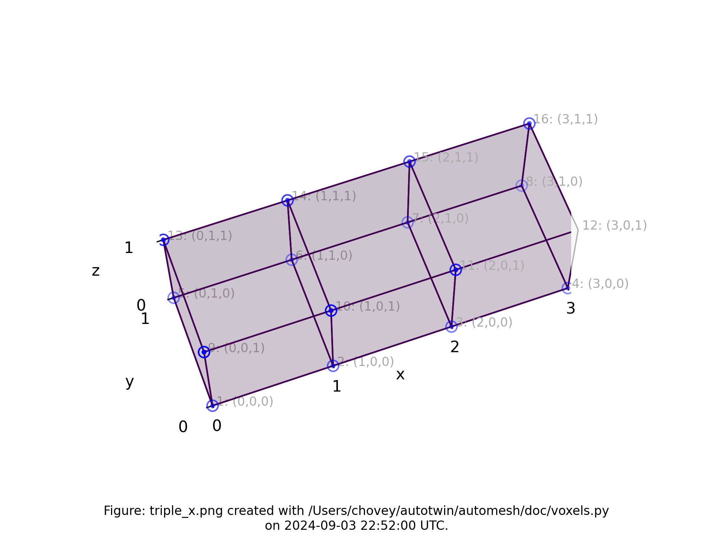
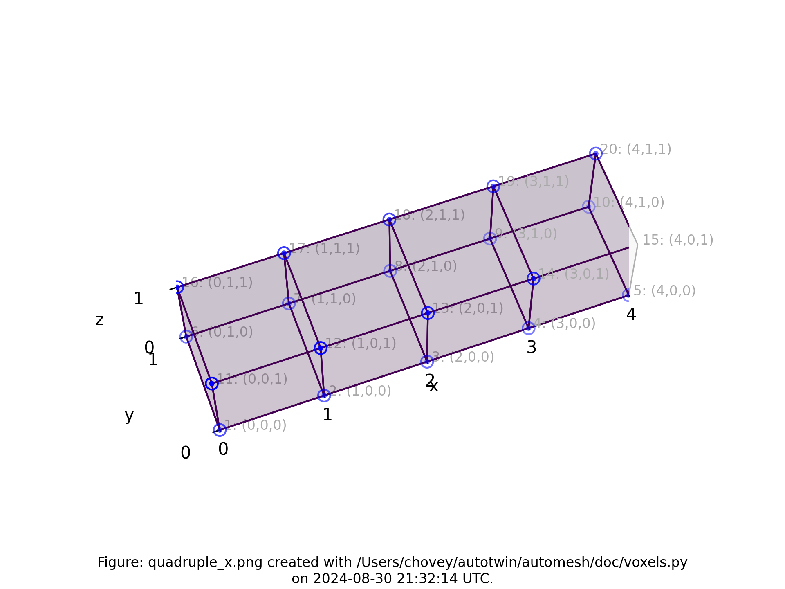

# Introduction

`Automesh` is an automatic mesh generation tool that converts a segmentation
into a finite element mesh.

Segmentations can be represented as either a Numpy (`.npy`) file
or a SPN (`.spn`) file.

A SPN file is a text (human-readable) file that contains a single a
column of non-negative integer values.  Each integer value defines a
unique category of a segmentation.

A category is typically used to defined a material (such as void, solid,
air, or precipitate) in a 3D computed tomography (CT) scan of a part or
assembly.  A 3D scan is composed of a stack of 2D images.
Each image is composed of pixels.  A stack of images composes a
3D voxel representation.

The range of integer values is not limited, but a practical example of a
range could be `[0, 1, 2, 3, 4]`.  The integers do not need to be sequential,
so a range, for example, of `[4, 501, 2]` is valid, but not conventional.
The number of rows that compose the SPN file equals the number of voxels
used to construct a 3D segmentation.  Axis order (for example,
`x`, `y`, then `z`; or, `z`, `y`, `x`, etc.) is not implied by the SPN structure;
so additional data, typically provided through a configuration file, is
needed to uniquely interpret the pixel tile and voxel stack order
of the data in the SPN file.

## Conventions

We use the Exodus II convention for a hexahedral element
local node numbering:


> Figure: Exodus II hexahedral local finite element numbering scheme, from Schoof *et al.*[^Schoof-1994].

## Testing

Following is documentation for tests used to validate code implementation.

### Single

*The First Minimum Working Example*

The minimum working example (MWE) is a single voxel, used to create a single
mesh consisting of one block consisting of a single element.  The NumPy
input [single.npy](../tests/input/single.npy) contains the following
segmentation:

```bash
segmentation = np.array(
    [
        [
            [
                11,
            ],
        ],
    ],
    dtype=np.uint8,
)
```

where the segmenetation ID, `11`, will denote block `11` in the finite element
mesh.

Equivalently, the [single.spn](../tests/input/single.spn) contains a
single integer:

```bash
11
```

The resulting finite element mesh is visualized is shown in the following
figure:


> Figure: The `single.png` visualization.  Blue dots designate lattice points.
Blue circles designate element nodes.  Global node numbers appear in gray, with
lattice `(x, y, z)` coordinates in parenthesis.  The right-hand rule is used.
Lattice coordinates start at `(0, 0, 0)`, and proceed along the `x-axis`, then
`y-axis`, then `z-axis`.

The local node numbering map to the following global node numbers:

```bash
[1, 2, 4, 3, 5, 6, 8, 7]
```

## Double

The next level of complexity example is a two voxel domain, used to create
a single block composed of two finite elements.  We test propagation in
both the `x` and `y` directions.  The figures below show these two
meshes.

 
> Figure: Meshes composed of a single block with two elements, propagating
along the `x-axis` and `y-axis`, respectively.

## Triple



## Quadruple



## References

[^Schoof-1994]: Schoof LA, Yarberry VR. EXODUS II: a finite element data model. Sandia National Lab.(SNL-NM), Albuquerque, NM (United States); 1994 Sep 1. [link](https://www.osti.gov/biblio/10102115)
