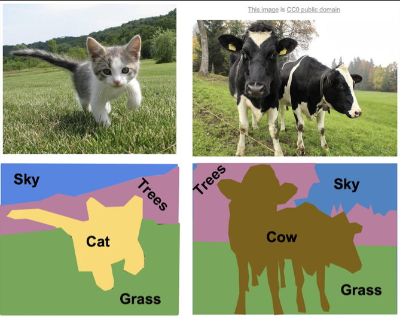
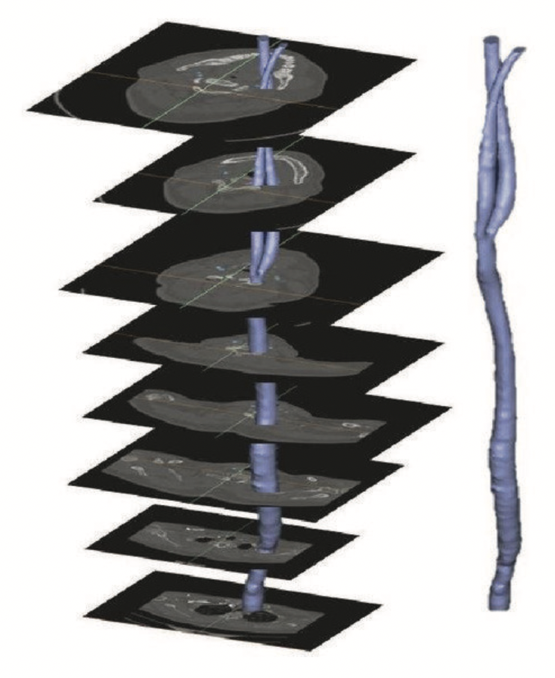
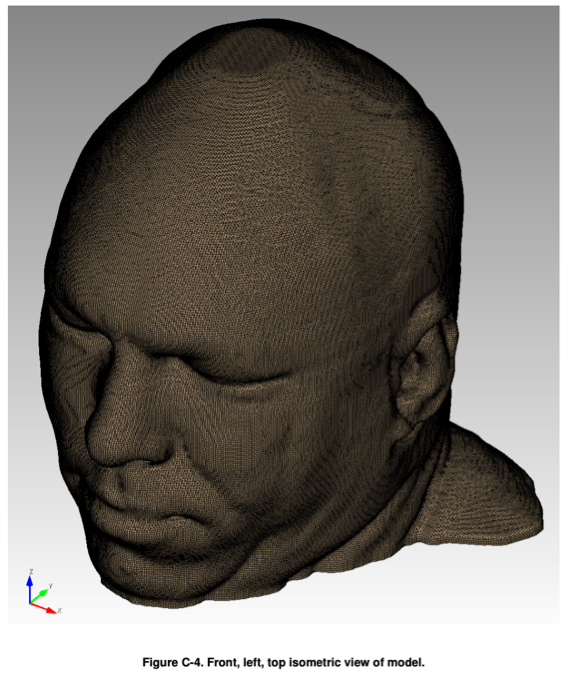
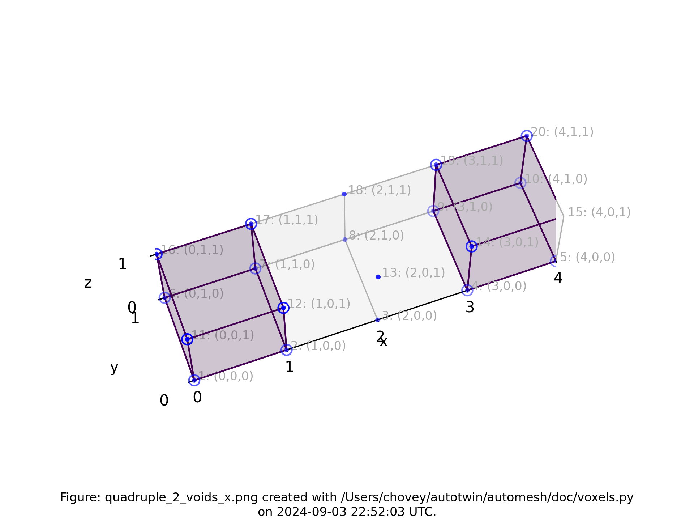
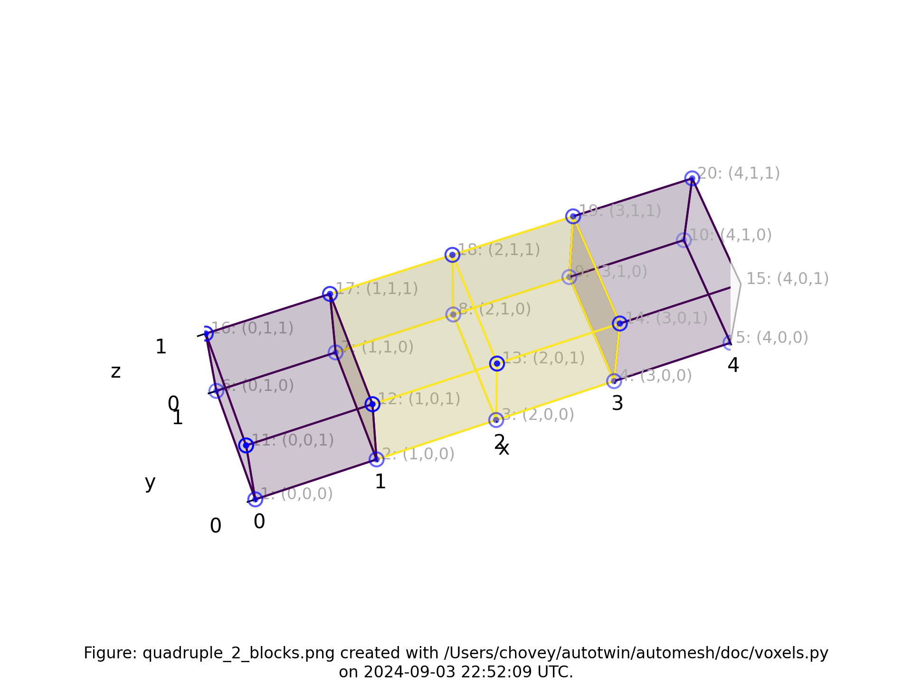
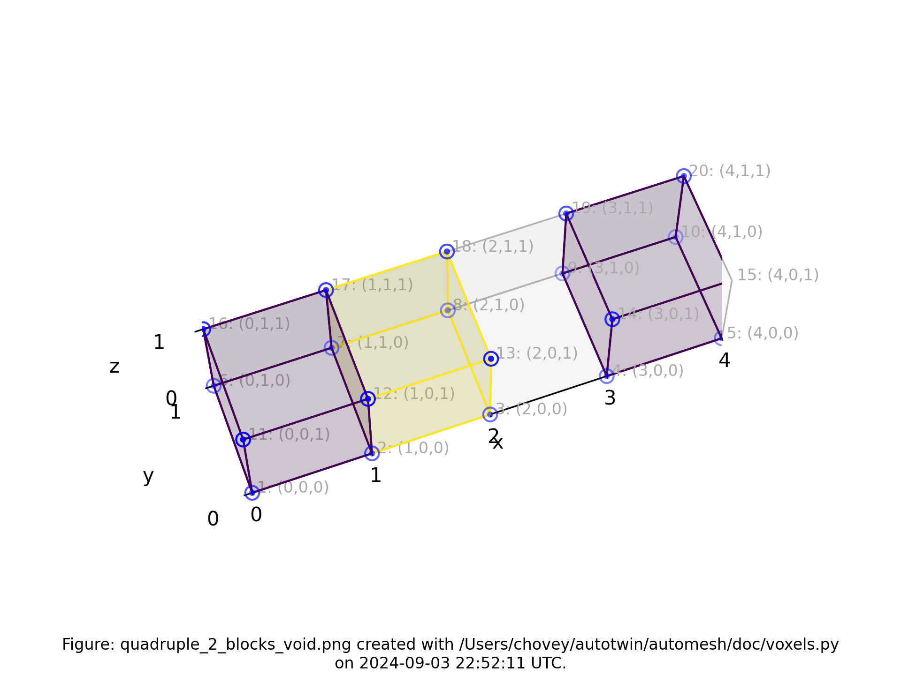
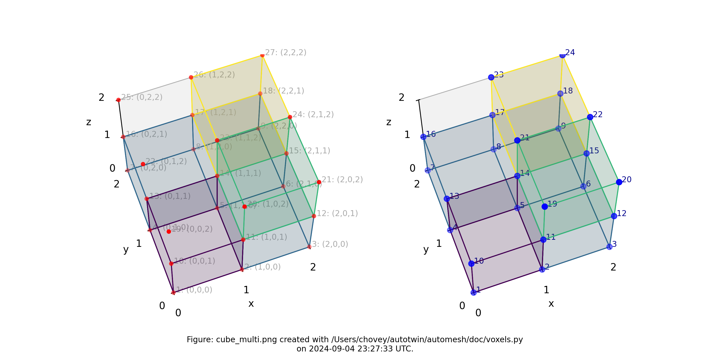
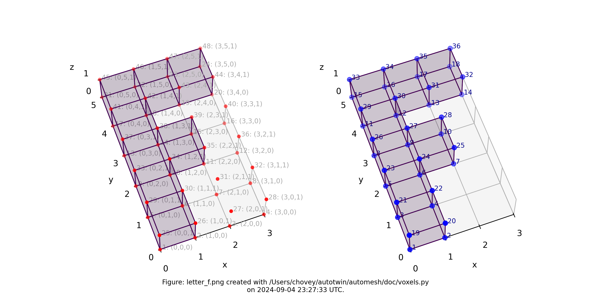
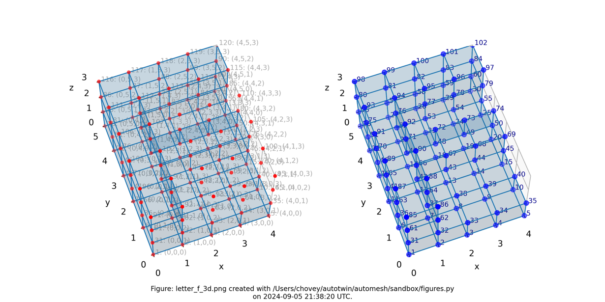
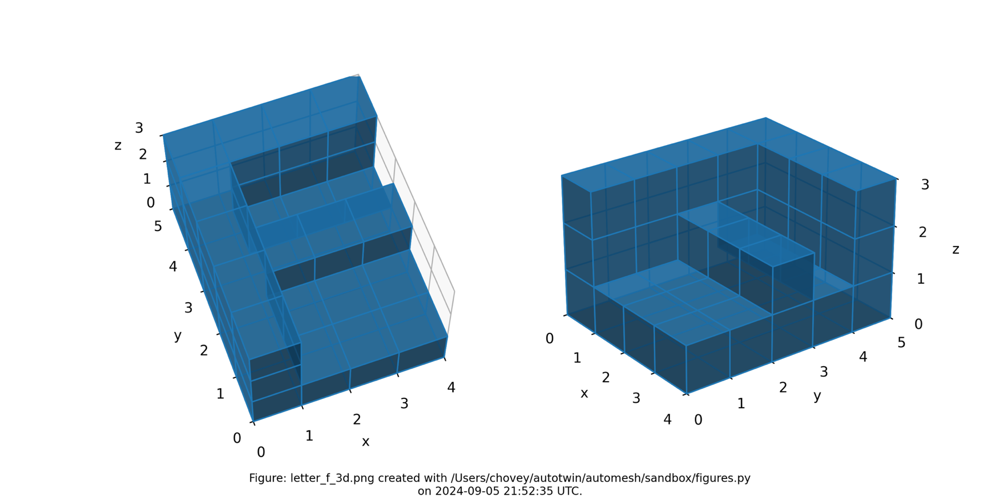

# Introduction

`Automesh` is an automatic mesh generation tool that converts a segmentation
into a hexahedral finite element mesh.

## Segmentation

Segmentation is the process of categorizing pixels that compose a digital image
into a *class* that represents some subject of interest.  For example, in the
image below, the image pixels are classified into classes of sky, trees, cat,
grass, and cow.



Figure: Example of semantic segmentation, from Li *et al.*[^Li_2017]

* **Semantic segmentation** does not differentiate between objects of the same class.
* **Instance segmentation** does differentiate between objects of the same class.

These two concepts are shown below:


Figure: Distinction between semantic segmentation and instance segmentation, from Lin *et al.*[^Lin_2014]

Both segmentation types, semantic and instance, can be used with `Automesh`.  However, `Automesh` operates on a 3D segmentation, not a 2D segmentation, as present in a digital image.  To obtain a 3D segmentation, two or more images are stacked to compose a volume.

The structured volume of a stacked of pixel composes a volumetric unit called a voxel.  A voxel, in the context of this work, will have the same dimensionality in the `x` and `y` dimension as the pixel in the image space, and will have the `z` dimensionality that is the stack interval distance between each image slice.  All pixels are rectangular, and all voxels are cuboid.

The figure below illustrates the concept of stacked images:



Figure: Example of stacking several images to create a 3D representation, from Bit *et al.*[^Bit_2017]

The digital image sources are frequently medical images, obtained by CT or MR, though `Automesh` can be used for any subject that can be represented as a stacked segmentation.  Anatomical regions are classified into categories.  For example, in the image below, ten unique integers have been used to represent
bone, disc, vasculature, airway/sinus, membrane, cerebral spinal fluid, white matter, gray matter, muscle, and skin.


Figure: Example of a 3D voxel model, segmented into 10 categories, from Terpsma *et al.*[^Terpsma_2020]

Given a 3D segmentation, for any image slice that composes it, the pixels have been classified
into categories that are designated with unique, non-negative integers.
The range of integer values is limited to `256 = 2^8`, since the `uint8` data type is specified.
A practical example of a range could be `[0, 1, 2, 3, 4]`.  The integers do not need to be sequential,
so a range of `[4, 501, 2, 0, 42]` is also valid, but not conventional.

Segmentations are frequently serialized (saved to disc) as either a Numpy (`.npy`) file
or a SPN (`.spn`) file.

A SPN file is a text (human-readable) file that contains a single a
column of non-negative integer values.  Each integer value defines a
unique category of a segmentation.

Axis order (for example,
`x`, `y`, then `z`; or, `z`, `y`, `x`, etc.) is not implied by the SPN structure;
so additional data, typically provided through a configuration file, is
needed to uniquely interpret the pixel tile and voxel stack order
of the data in the SPN file.

For subjects that the human anatomy, we use the *Patient Coordinate System* (PCS), which directs the
`x`, `y`, and `z` axes to the `left`, `posterior`, and `superior`, as shown below:

| Patient Coordinate System: | Left, Posterior, Superior $\mapsto$ (x, y, z)
| :--: | :--:
|  | 

Figure: Illustration of the patient coordinate system, left figure from Terpsma *et al.*[^Terpsma_2020] and right figure from Sharma.[^Sharma_2021]

## Finite Element Mesh

### ABAQUS

To come.

### EXODUS II

> EXODUS II is a model developed to store and retrieve data for finite element analyses.  It is used for preprocesing (problem definition), postprocessing (results visualization), as well as code to code data transfer.  An EXODUS II data file is a random access, machine independent binary file.[^Schoof_1994]

EXODUS II depends on the Network Common Data Form ([NetCDF](https://www.unidata.ucar.edu/software/netcdf/)) library.

NetCDF is a public domain database library that provides low-level data storage.  The NetCDF library stores data in eXternal Data Representation (XDR) format, which provides machine independency.

EXODUS II library functions provide a map between finite element data objects and NetCDF dimensions, attributes, and variables.

EXODUS II data objects:

* Initialization Data
  * Number of nodes
  * Number of elements
  * *optional* informational text
  * et cetera
* Model - static objects (i.e., objects that do not change over time)
  * Nodal coordinates
  * Element connectivity
  * Node sets
  * Side sets
* *optional* Results
  * Nodal results
  * Element results
  * Global results

> Note: `automesh` will use Initialization Data and Model sections; it will not use the Results section.

We use the Exodus II convention for a hexahedral element
local node numbering:


Figure: Exodus II hexahedral local finite element numbering scheme, from Schoof *et al.*[^Schoof_1994]

## Testing

Following is documentation for tests used to validate code implementation.

**Remark:** We use the convention `np` when importing `numpy` as follows:

```python
import numpy as np
```

### Single

The minimum working example (MWE) is a single voxel, used to create a single
mesh consisting of one block consisting of a single element.  The NumPy
input [single.npy](https://github.com/autotwin/automesh/raw/main/tests/input/single.npy) contains the following
segmentation:

```python
segmentation = np.array(
    [
        [
            [
                11,
            ],
        ],
    ],
    dtype=np.uint8,
)
```

where the segmentation `11` denotes block `11` in the finite element mesh.

**Remark:** Serialization (write and read)

| Write | Read |
|----------|----------|
| Use the [np.save](https://numpy.org/doc/stable/reference/generated/numpy.save.html) command to serialize the segmentation a `.npy` file  | Use the [np.load](https://numpy.org/doc/stable/reference/generated/numpy.load.html) command to deserialize the segmentation from a `.npy` file  |
*Example: Write the data in `segmentation` to a file called `seg.npy`*</br></br>`np.save("seg.npy", segmentation)` | *Example: Read the data from the file `seg.npy` to a variable called `loaded_array`*</br></br>`loaded_array = np.load("seg.npy")`

Equivalently, the [single.spn](https://raw.githubusercontent.com/autotwin/automesh/main/tests/input/single.spn) contains a
single integer:

```bash
11
```

The resulting finite element mesh is visualized is shown in the following
figure:


Figure: The `single.png` visualization, (left) lattice node numbers, (right) mesh node numbers.
Lattice node numbers appear in gray, with `(x, y, z)` indices in parenthesis.  The right-hand rule is used.
Lattice coordinates start at `(0, 0, 0)`, and proceed along the `x-axis`, then
the `y-axis`, and then the `z-axis`.

The finite element mesh local node numbering map to the following global node numbers:

```bash
[1, 2, 4, 3, 5, 6, 8, 7] -> [1, 2, 5, 3, 5, 6, 8, 7]
```

which is a special case not typically observed, as shown in more complex examples below.

## Double

The next level of complexity example is a two-voxel domain, used to create
a single block composed of two finite elements.  We test propagation in
both the `x` and `y` directions.  The figures below show these two
meshes.

### Double X

```python
segmentation = np.array(
    [
        [
            [
                11, 11
            ],
        ],
    ],
    dtype=np.uint8,
)
```

where the segmentation `11` denotes block `11` in the finite element mesh.


Figure: Mesh composed of a single block with two elements, propagating along the `x-axis`, (left) lattice node numbers, (right) mesh node numbers.

### Double Y

```python
segmentation = np.array(
    [
        [
            [
                11,
            ],
            [
                11,
            ],
        ],
    ],
    dtype=np.uint8,
)
```

where the segmentation `11` denotes block `11` in the finite element mesh.


Figure: Mesh composed of a single block with two elements, propagating along the `y-axis`, (left) lattice node numbers, (right) mesh node numbers.

## Triple

```python
segmentation = np.array(
    [
        [
            [
                11,
                11,
                11,
            ],
        ],
    ],
    dtype=np.uint8,
)
```

where the segmentation `11` denotes block `11` in the finite element mesh.


Figure: Mesh composed of a single block with three elements, propagating along the `x-axis`, (left) lattice node numbers, (right) mesh node numbers.

## Quadruple

```python
segmentation = np.array(
    [
        [
            [
                11,
                11,
                11,
                11,
            ],
        ],
    ],
    dtype=np.uint8,
)
```

where the segmentation `11` denotes block `11` in the finite element mesh.


Figure: Mesh composed of a single block with four elements, propagating along the `x-axis`, (left) lattice node numbers, (right) mesh node numbers.

## Quadruple with Voids

```python
egmentation = np.array(
    [
        [
            [
                99,
                0,
                0,
                99,
            ],
        ],
    ],
    dtype=np.uint8,
)
```

where the segmentation `99` denotes block `99` in the finite element mesh, and segmentation `0` is excluded from the mesh.



Figure: Mesh composed of a single block with two elements, propagating along the `x-axis` and two voids, (left) lattice node numbers, (right) mesh node numbers.

## Quadruple with Two Blocks

```python
segmentation = np.array(
    [
        [
            [
                100,
                101,
                101,
                100,
            ],
        ],
    ],
    dtype=np.uint8,
)
```

where the segmentation `100` and `101` denotes block `100` and `101`, respectively in the finite element mesh.



Figure: Mesh composed of two blocks with two elements elements each, propagating along the `x-axis`, (left) lattice node numbers, (right) mesh node numbers.

## Quadruple with Two Blocks and Void

```python
segmentation = np.array(
    [
        [
            [
                102,
                103,
                0,
                102,
            ],
        ],
    ],
    dtype=np.uint8,
)
```

where the segmentation `102` and `103` denotes block `102` and `103`, respectively, in the finite element mesh, and segmentation `0` will be included from the finite element mesh.



Figure: Mesh composed of one block with two elements, a second block with one element, and a void, propagating along the `x-axis`, (left) lattice node numbers, (right) mesh node numbers.

## Cube

```python
segmentation = np.array(
    [
        [
            [
                11,
                11,
            ],
            [
                11,
                11,
            ],
        ],
        [
            [
                11,
                11,
            ],
            [
                11,
                11,
            ],
        ],
    ],
    dtype=np.uint8,
)
```

where the segmentation `11` denotes block `11` in the finite element mesh.


Figure: Mesh composed of one block with eight elements, (left) lattice node numbers, (right) mesh node numbers.

## Cube with Multi Blocks and Void

```python
segmentation = np.array(
[
    [
        [
            82,
            2,
        ],
        [
            2,
            2,
        ],
    ],
    [
        [
            0,
            31,
        ],
        [
            0,
            44,
        ],
    ],
],
dtype=np.uint8,
)
```

where the segmentation `82`, `2`, `31` and `44` denotes block `82`, `2`, `31` and `44`, respectively, in the finite element mesh, and segmentation `0` will be included from the finite element mesh.



Figure: Mesh composed of four blocks (block `82` has one element, block `2` has three elements, block `31` has one element, and block `44` has one element), (left) lattice node numbers, (right) mesh node numbers.

## Sparse

To come.

## Letter F

```python
segmentation = np.array(
    [
        [
            [
                11,
                0,
                0,
            ],
            [
                11,
                0,
                0,
            ],
            [
                11,
                11,
                0,
            ],
            [
                11,
                0,
                0,
            ],
            [
                11,
                11,
                11,
            ],
        ],
    ],
    dtype=np.uint8,
)
```

where the segmentation `11` denotes block `11` in the finite element mesh.



Figure: Mesh composed of a single block with eight elements, (left) lattice node numbers, (right) mesh node numbers.

## Letter F in 3D

```python
segmentation = np.array(
    [
        [
            [1, 1, 1, 1],
            [1, 1, 1, 1],
            [1, 1, 1, 1],
            [1, 1, 1, 1],
            [1, 1, 1, 1],
        ],
        [
            [1, 0, 0, 0],
            [1, 0, 0, 0],
            [1, 1, 1, 1],
            [1, 0, 0, 0],
            [1, 1, 1, 1],
        ],
        [
            [1, 0, 0, 0],
            [1, 0, 0, 0],
            [1, 0, 0, 0],
            [1, 0, 0, 0],
            [1, 1, 1, 1],
        ],
    ],
    dtype=np.uint8,
)
```

where the segmentation `1` denotes block `1` in the finite element mesh.

For concreteness, we note the shape of the `segmentation`

```python
segmentation.shape
(3, 5, 4)
```

which corresponds to `--nelz 3`, `--nely 5`, and `--nelx  4` in the [command line interface](cli.md).



Figure: Mesh composed of a single block with thirty-nine elements, (left) lattice node numbers, (right) mesh node numbers.

The shape of the solid segmentation is more easily seen without the lattice and element nodes, and with decreased opacity, as shown below:



Figure: Mesh composed of a single block with thirty-nine elements, shown with decreased opacity and without lattice and element node numbers.

## References

[^Li_2017]: Li FF, Johnson J, Yeung S.  Lecture 11: Dection and Segmentation, CS 231n, Stanford Unveristy, 2017.  [link](https://cs231n.stanford.edu/slides/2017/cs231n_2017_lecture11.pdf)

[^Lin_2014]: Lin TY, Maire M, Belongie S, Hays J, Perona P, Ramanan D, Dollár P, Zitnick CL. Microsoft coco: Common objects in context. In Computer Vision–ECCV 2014: 13th European Conference, Zurich, Switzerland, September 6-12, 2014, Proceedings, Part V 13 2014 (pp. 740-755). Springer International Publishing. [link](https://arxiv.org/pdf/1405.0312v3)

[^Bit_2017]: Bit A, Ghagare D, Rizvanov AA, Chattopadhyay H. Assessment of influences of stenoses in right carotid artery on left carotid artery using wall stress marker. BioMed research international. 2017;2017(1):2935195. [link](https://onlinelibrary.wiley.com/doi/pdf/10.1155/2017/2935195)

[^Terpsma_2020]: Terpsma RJ, Hovey CB. Blunt impact brain injury using cellular injury criterion. Sandia National Lab. (SNL-NM), Albuquerque, NM (United States); 2020 Oct 1. [link](https://www.osti.gov/servlets/purl/1716577)

[^Sharma_2021]: Sharma S. DICOM Coordinate Systems — 3D DICOM for computer vision engineers, Medium, 2021-12-22. [link](https://medium.com/redbrick-ai/dicom-coordinate-systems-3d-dicom-for-computer-vision-engineers-pt-1-61341d87485f)

[^Schoof_1994]: Schoof LA, Yarberry VR. EXODUS II: a finite element data model. Sandia National Lab. (SNL-NM), Albuquerque, NM (United States); 1994 Sep 1. [link](https://www.osti.gov/biblio/10102115)
