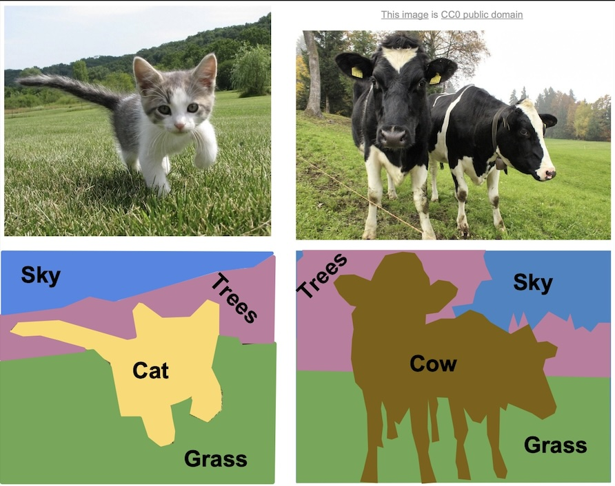
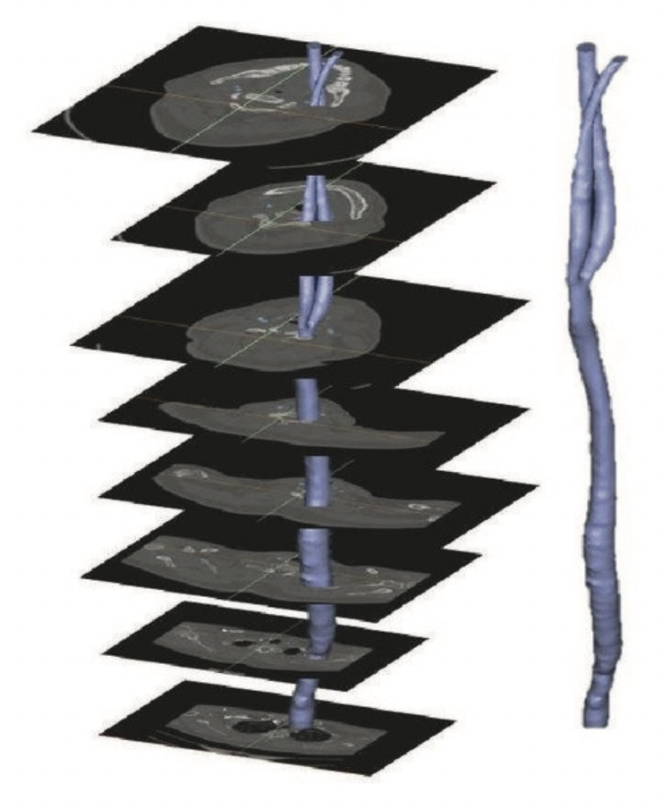
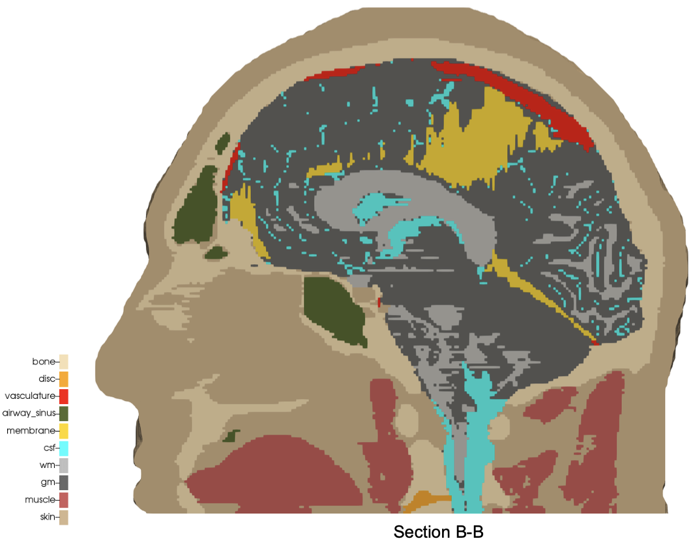
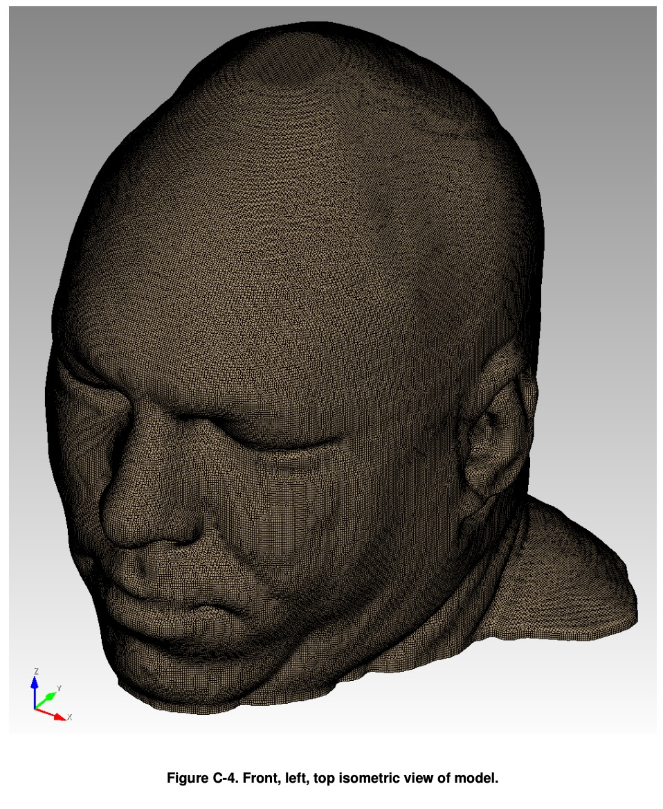
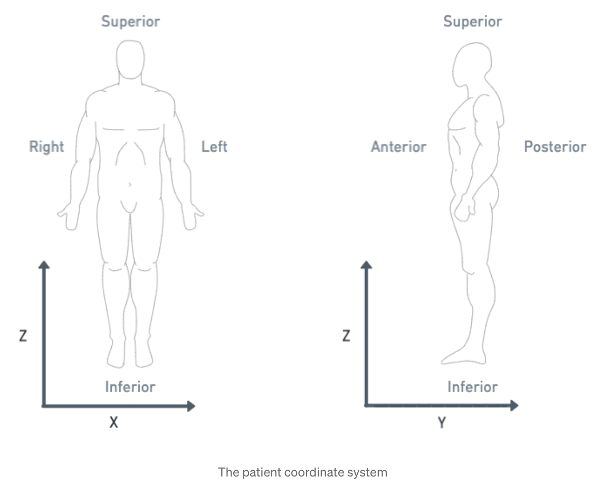

# Introduction

`Automesh` is an automatic mesh generation tool that converts a segmentation
into a finite element mesh.

## Segmentation

Segmentation is the process of categorizing pixels that compose a digital image
into a *class* that represents some subject of interest.  For example, in the
image below, the image pixels are classified into classes of sky, trees, cat,
grass, and cow.



Figure: Example of semantic segmentation, from Li *et al.*[^Li-2017]

* **Semantic segmentation** does not differentiate between objects of the same class.
* **Instance segmentation** does differentiate between objects of the same class.

These two concepts are shown below:


Figure: Distinction between semantic segmentation and instance segmentation, from Lin *et al.*[^Lin-2014]

Both  segmentation types, semantic and instance, can be used with `Automesh`.  However, `Automesh` operates on a 3D segmentation, not a 2D segmentation, as present in a digital image.  To arrive at a 3D segmentation, two or more images are stacked to compose a volume.

The structured volume of stacks of pixels compose a volumetric unit called a voxel.  A voxel, in the context of this work, will have the same dimensionality in the `x` and `y` dimension as the pixel in the image space, and will have the `z` dimensionality that is stacked distance between each image slice.

The figure below illustrates the concept of stacked images:



Figure: Example of stacking several images to create a 3D representation, from Bit *et al.*[^Bit-2017]

The digital image sources are frequently medical images, obtained by CT or MR, though `Autotwin` can be used for any subject that can be represented as a stacked segmentation.  Anatomical regions are classified into categories, for example, to represent scale, bone, gray matter, white matter, and cerebral spinal fluid.

Given a 3D segmentation, for any image slice that composes it, the pixels have been classified
into categories that are designated with unique integers.
The range of integer values is not limited, but a practical example of a
range could be `[0, 1, 2, 3, 4]`.  The integers do not need to be sequential,
so a range, for example, of `[4, 501, 2]` is valid, but not conventional.

For example, in the image below, ten unique integers have been used to designate anatomical structure of
bone, disc, vasculature, airway/sinus, membrane, cerebral spinal fluid, white matter, gray matter, muscle, and skin.



Figure: Example of medical images used to create 3D voxel model, segmented into 10 categories, from Terpsma *et al.*[^Terpsma-2020]

Segmentations are frequently serialzed (saved to disc) as either a Numpy (`.npy`) file
or a SPN (`.spn`) file.

A SPN file is a text (human-readable) file that contains a single a
column of non-negative integer values.  Each integer value defines a
unique category of a segmentation.

Axis order (for example,
`x`, `y`, then `z`; or, `z`, `y`, `x`, etc.) is not implied by the SPN structure;
so additional data, typically provided through a configuration file, is
needed to uniquely interpret the pixel tile and voxel stack order
of the data in the SPN file.

For subjects that the human anatomy, we use the *Patient Coordinate System* (PCS), which directs the
`x`, `y`, and `z` axes to the `left`, `posterior`, and `superior`, as shown below:

| Patient Coordinate System: | Left, Posterior, Superior $\mapsto$ (x, y, z)
| :--: | :--:
|  | 

Figure: Illustration of the patient coordinate system, left figure[^Terpsma_2020] and right figure.[^Sharma_201]

## Finite Element Mesh
We use the Exodus II convention for a hexahedral element
local node numbering:


Figure: Exodus II hexahedral local finite element numbering scheme, from Schoof *et al.*[^Schoof-1994]

## Testing

Following is documentation for tests used to validate code implementation.

### Single

*The First Minimum Working Example*

The minimum working example (MWE) is a single voxel, used to create a single
mesh consisting of one block consisting of a single element.  The NumPy
input [single.npy](../tests/input/single.npy) contains the following
segmentation:

```bash
segmentation = np.array(
    [
        [
            [
                11,
            ],
        ],
    ],
    dtype=np.uint8,
)
```

where the segmenetation ID, `11`, will denote block `11` in the finite element
mesh.

Equivalently, the [single.spn](../tests/input/single.spn) contains a
single integer:

```bash
11
```

The resulting finite element mesh is visualized is shown in the following
figure:


Figure: The `single.png` visualization.  Blue dots designate lattice points.
Blue circles designate element nodes.  Global node numbers appear in gray, with
lattice `(x, y, z)` coordinates in parenthesis.  The right-hand rule is used.
Lattice coordinates start at `(0, 0, 0)`, and proceed along the `x-axis`, then
`y-axis`, then `z-axis`.

The local node numbering map to the following global node numbers:

```bash
[1, 2, 4, 3, 5, 6, 8, 7]
```

## Double

The next level of complexity example is a two voxel domain, used to create
a single block composed of two finite elements.  We test propagation in
both the `x` and `y` directions.  The figures below show these two
meshes.

 

Figure: Meshes composed of a single block with two elements, propagating
along the `x-axis` and `y-axis`, respectively.

## Triple


## Quadruple


## References

[^Li-2017]: Li FF, Johnson J, Yeung S.  Lecture 11: Dection and Segmentation, CS 231n, Stanford Unveristy, 2017.  [link](https://cs231n.stanford.edu/slides/2017/cs231n_2017_lecture11.pdf)

[^Lin-2014]: Lin TY, Maire M, Belongie S, Hays J, Perona P, Ramanan D, Dollár P, Zitnick CL. Microsoft coco: Common objects in context. InComputer Vision–ECCV 2014: 13th European Conference, Zurich, Switzerland, September 6-12, 2014, Proceedings, Part V 13 2014 (pp. 740-755). Springer International Publishing. [link](https://arxiv.org/pdf/1405.0312v3)

[^Bit-2017]: Bit A, Ghagare D, Rizvanov AA, Chattopadhyay H. Assessment of influences of stenoses in right carotid artery on left carotid artery using wall stress marker. BioMed research international. 2017;2017(1):2935195. [link](https://onlinelibrary.wiley.com/doi/pdf/10.1155/2017/2935195)

[^Terpsma-2020]: Terpsma RJ, Hovey CB. Blunt impact brain injury using cellular injury criterion. Sandia National Lab.(SNL-NM), Albuquerque, NM (United States); 2020 Oct 1. [link](https://www.osti.gov/servlets/purl/1716577)

[^Schoof-1994]: Schoof LA, Yarberry VR. EXODUS II: a finite element data model. Sandia National Lab.(SNL-NM), Albuquerque, NM (United States); 1994 Sep 1. [link](https://www.osti.gov/biblio/10102115)
