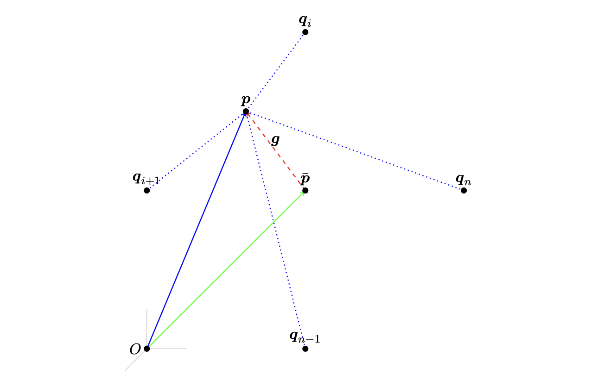

# Smoothing

Both Laplacian smoothing and Taubin smoothing[^Taubin_1995a] [^Taubin_1995b] are smoothing operations that adjust the positions of the nodes in a finite element mesh.

Laplacian smoothing, based on the Laplacian operator, computes the average position of a point's neighbors and moves the point toward the average.  This reduces high-frequency noise, but can result in a loss of shape and detail, with overall shrinkage.  

Taubin smoothing is an extension of Laplacian smoothing that seeks to overcome the shrinkage drawback associated with the Laplacian approach.   Taubin is a two-pass approach.  The first pass smooths the mesh.  The second pass re-expands the mesh.

## Laplacian Smoothing

Consider a subject node with position $\boldsymbol{p} = \boldsymbol{p}(x, y, z)$.  The subject node connects to $n$ neighbor points $\boldsymbol{q}_i$ for $i \in [1, n]$ through $n$ edges. 

For concereteness, consider a node with four neighbors, shown in the figure below.

Figure: The subject node $\boldsymbol{p}$ with edge connections (dotted lines) to neighbor nodes $\boldsymbol{q}_i$ with $i \in [1, n]$ (withouth loss of generality, the specific example of $n=4$ is shown).  The average position of all neighbors of $\boldsymbol{p}$ is denoted $\bar{\boldsymbol{q}}$, and the gap $\Delta \boldsymbol{p}$ (dashed line) originates at $\boldsymbol{p}$ and terminates at $\bar{\boldsymbol{q}}$.

Define $\bar{\boldsymbol{q}}$ as the average position of all $\boldsymbol{q}_i$ neighbors of $\boldsymbol{p}$,

$$ \bar{\boldsymbol{q}} := \frac{1}{n} \sum_{i=1}^n \boldsymbol{q}_i.  $$

Define the gap vector $\Delta\boldsymbol{p}$ as originating at $\boldsymbol{p}$ and terminating at $\bar{\boldsymbol{q}}$ (*viz.*, $\boldsymbol{p} + \Delta\boldsymbol{p} = \bar{\boldsymbol{q}}$),

$$ \Delta\boldsymbol{p} := \bar{\boldsymbol{q}} - \boldsymbol{p}. $$

Let $\lambda \in \mathbb{R}^+$ be the positive scaling factor for the gap $\Delta\boldsymbol{p}$.

Since 

$$ \bar{\boldsymbol{q}} = \boldsymbol{p} + \lambda\Delta\boldsymbol{p} \hspace{0.5cm} \rm{when} \hspace{0.5cm} \lambda = 1, $$

subdivision of this relationship into several substeps gives rise to an iterative approach.
We typically select $\lambda < 1$ to avoid overshoot of the update, $\lambda \in \mathbb{R}^+ \subset (0, 1)$.

At iteration $k$, we update the position of $\boldsymbol{p}^{(k)}$ by an amount $\lambda \Delta\boldsymbol{p}^{(k)}$ to $\boldsymbol{p}^{(k+1)}$ as

$$ \boldsymbol{p}^{(k+1)} := \boldsymbol{p}^{(k)} + \lambda \Delta\boldsymbol{p}^{(k)}, $$

with

$$ \Delta\boldsymbol{p}^{(k)} = \bar{\boldsymbol{q}}^{(k)} - \boldsymbol{p}^{(k)}. $$

Thus 

$$ \boldsymbol{p}^{(k+1)} := \boldsymbol{p}^{(k)} + \lambda \left( \Delta\boldsymbol{p}^{(k)}\right), $$

$$ \boldsymbol{p}^{(k+1)} := \boldsymbol{p}^{(k)} + \lambda \left( \bar{\boldsymbol{q}}^{(k)} - \boldsymbol{p}^{(k)} \right), $$

and finally

$$ \boxed{\boldsymbol{p}^{(k+1)} := \boldsymbol{p}^{(k)} + \lambda \left( \frac{1}{n} \sum_{i=1}^n \boldsymbol{q}_i^{(k)} - \boldsymbol{p}^{(k)} \right).} $$

> The formulation above, based on the average position of the neighbors, is a special case of the more generalized presentation of Laplace smoothing, wherein a normalized weighting factor, $w_i$, is used: 

$$ \boldsymbol{p}^{(k+1)} := \boldsymbol{p}^{(k)} + \lambda \sum_{i=1}^n w_i \left( \boldsymbol{q}_i^{(k)} - \boldsymbol{p}^{(k)} \right). $$

> When all weights are equal and normalized by the number of neighbors, $w_i = \frac{1}{n}$, the special case presented in the box above is recovered.

### Example

For a 1D configuration, consider a node with initial position $\boldsymbol{p} = 1.5$ with two neighbors (that never move) with positions $\boldsymbol{q}_1 = 0.0$ and $\boldsymbol{q}_2 = 1.0$ ($\bar{\boldsymbol{q}} = 0.5$).  With $\lambda = 0.3$, the table below shows updates for for position $\boldsymbol{p}$.

Table: Iteration updates of a 1D example.

$k$ | $\bar{\boldsymbol{q}}^{(k)}$ | $\boldsymbol{p}^{(k)}$ | $\Delta\boldsymbol{p}^{(k)} = \bar{\boldsymbol{q}} - \boldsymbol{p}^{(k)}$ | $\lambda \Delta\boldsymbol{p}^{(k)}$
--- | --- | --- | --- | ---
0 | 0.5 | 1.5 | -1 | -0.3
1 | 0.5 | 1.2 | -0.7 | -0.21
2 | 0.5 | 0.99 | -0.49 | -0.147
3 | 0.5 | 0.843 | -0.343 | -0.1029
4 | 0.5 | 0.7401 | -0.2401 | -0.07203
5 | 0.5 | 0.66807 | -0.16807 | -0.050421
6 | 0.5 | 0.617649 | -0.117649 | -0.0352947
7 | 0.5 | 0.5823543 | -0.0823543 | -0.02470629
8 | 0.5 | 0.55764801 | -0.05764801 | -0.017294403
9 | 0.5 | 0.540353607 | -0.040353607 | -0.012106082
10 | 0.5 | 0.528247525 | -0.028247525 | -0.008474257

Figure: Convergence of position $\boldsymbol{p}$ toward $0.5$ as a function of iteration $k$.

## Taubin Smoothing

Taubin smoothing is a two-parameter, two-pass iterative variation of Laplace smoothing.
Specifically with the definitions used in Laplacian smoothing, a second negative parameter $\mu$ is used, where

$$ \lambda \in \mathbb{R}^+ \subset (0, 1) \hspace{0.5cm} \rm{and} \hspace{0.5cm} \lambda < -\mu. $$

The first parameter, $\lambda$, tends to smooth (and shrink) the domain.  The second parameter, $\mu$, tends to expand the domain.

Taubin smoothing is written as, for $k = 0$, $k < k_{\rm{max}}$, $k = k+1$, with $k_{\rm{max}}$ an even number,

* **First pass** (if $k$ is even):

$$ {\boldsymbol{p}^{(k+1)} := \boldsymbol{p}^{(k)} + \lambda \left( \frac{1}{n} \sum_{i=1}^n \boldsymbol{q}_i^{(k)} - \boldsymbol{p}^{(k)} \right),} $$

* **Second pass** (if $k$ is odd):

$$ {\boldsymbol{p}^{(k+1)} := \boldsymbol{p}^{(k)} + \mu \left( \frac{1}{n} \sum_{i=1}^n \boldsymbol{q}_i^{(k)} - \boldsymbol{p}^{(k)} \right),} $$

> In any second pass (any pass with $k$ odd), the algorithm uses the updated positions from the previous (even) iteration to compute the new positions.  So, the average is taken from the updated neighbor positions rather than the original neighbor positions.  Some presentation of Taubin smoothing do not carefully state the second pass update, and so we emphasize it here.

## Hierarchical Control

Hierarchical control classifies all nodes in a mesh as belonging to a surface $\mathbb{A}$, interface $\mathbb{B}$, or interior $\mathbb{C}$.  These categories are mutually exclusive.  Any and all nodes must belong to one, and only one, of these three categories.  For a given node $\boldsymbol{p}$, let

* the set of *surface* neighbors be denoted $\boldsymbol{q}_{\mathbb{A}}$,
* the set of *interface* neighbors be denoted $\boldsymbol{q}_{\mathbb{B}}$, and
* the set of *interior* neighbors be denoted $\boldsymbol{q}_{\mathbb{C}}$.

Hierarchical control states that

* for any *surface* node $\boldsymbol{p} \in \mathbb{A}$, only surface nodes $\boldsymbol{q}_{\mathbb{A}}$ connected via edges to $\boldsymbol{p}$ are considered neighbors,
* for any *interface* node $\boldsymbol{p} \in \mathbb{B}$, only surface nodes $\boldsymbol{q}_{\mathbb{A}}$ and interface nodes $\boldsymbol{q}_{\mathbb{B}}$ connected via edges to $\boldsymbol{p}$ are neighbors, and
* for any *interior* node $\boldsymbol{p} \in \mathbb{C}$, surface nodes $\boldsymbol{q}_{\mathbb{A}}$, interface nodes $\boldsymbol{q}_{\mathbb{B}}$, and interior nodes $\boldsymbol{q}_{\mathbb{C}}$ connecting via edges to $\boldsymbol{p}$ are neighbors.

The following figure shows this concept:

Figure: Classification of nodes into categories of surface nodes $\mathbb{A}$, interface nodes $\mathbb{B}$, and interior nodes $\mathbb{C}$.  Hierarchical relationship: a surface node's neighbors are other other edge-connected surface nodes, an interface node's neighbors are other edge-connected interface nodes or surface nodes, and an interior node's neighbors are edge-connected nodes of any category.

### Chen Example

Chen[^Chen_2010] used medical image voxel data to create a structured hexahedral mesh.   They noded that the approach generated a mesh with "jagged edges on mesh surface and material interfaces," which can cause numerical artifacts.  

Chen used hierarchical Taubin mesh smoothing for eight (8) iterations, with $\lambda = 0.6307$ and $\mu = -0.6732$ to smooth the outer and inner surfaces of the mesh.

## References

[^Taubin_1995a]: Taubin G. Curve and surface smoothing without shrinkage. In *Proceedings of IEEE international conference on computer vision* 1995 Jun 20 (pp. 852-857). IEEE.  [paper](https://ieeexplore.ieee.org/stamp/stamp.jsp?arnumber=466848)

[^Taubin_1995b]: Taubin G. A signal processing approach to fair surface design. In *Proceedings of the 22nd annual conference on Computer graphics and interactive techniques* 1995 Sep 15 (pp. 351-358). [paper](https://dl.acm.org/doi/pdf/10.1145/218380.218473)

[^Chen_2010]: Chen Y, Ostoja-Starzewski M. MRI-based finite element modeling of head trauma: spherically focusing shear waves. Acta mechanica. 2010 Aug;213(1):155-67. [paper](https://link.springer.com/content/pdf/10.1007/s00707-009-0274-0.pdf)
