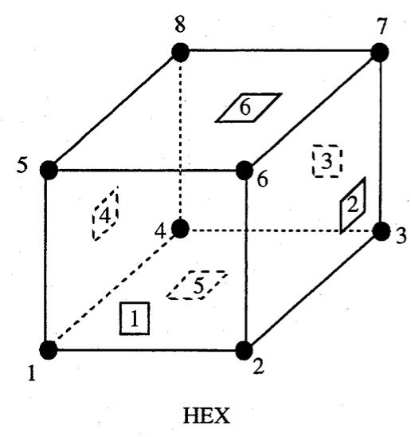

# Exodus II

## Excerpts from Schoof-1994[^Schoof-1994]:

"EXODUS II is a model developed to store and retrieve data for finite element analyses.  It is used for preprocesing (problem definition), postprocessing (results visualization), as well as code to code data transfer.  An EXODUS II data file is a random access, machine independent binary file..."

EXODUS II depends on the Network Common Data Form ([NetCDF](https://www.unidata.ucar.edu/software/netcdf/)) library.

NetCDF is a public domain database library that provides low-level data storage.  The NetCDF library stores data in eXternal Data Representation (XDR) format, which provides machine independency.

EXODUS II library functions provide a map between finite element data objects and NetCDF dimensions, attributes, and variables.

EXODUS II data objects:

* Initialization Data
  * Number of nodes
  * Number of elements
  * *optional* informational text
  * et cetera
* Model - static objects (i.e., objects that do not change over time)
  * Nodal coordinates
  * Element connectivity
  * Node sets
  * Side sets
* *optional* Results
  * Nodal results
  * Element results
  * Global results

Note: automesh will use Initialization Data and Model sections; it will not use the Results section.

Quadrilateral | Hexahedral
:---: | :---:
 | 

> Figure 1: EXODUS II node numbering scheme for quadrilateral and hexahedral finite elements.

Quadrilateral | Hexahedral
:---: | :---:
 | 

> Figure 2: EXODUS II sideset numbering scheme for quadrilateral and hexahedral finite elements.

## Pattern

```bash
------
Test 1
------
nsd = 2
nelx = nely = 1
   y
   ^
  3|      4
   *-----*
   |4   3|
   | (1) |
   |1   2|
   *-----* --> x
  1       2
coordinates
0 0
1 0
0 1
1 1
connectivity
1 2 4 3

------
Test 2
------
nelx = 2
nely = 1
   y
   ^
  4|     5      6
   *-----*-----*
   |4   3|4   3|
   | (1) | (2) |
   |1   2|1   2|
   *-----*-----* --> x
  1      2      3
coordinates
0 0
1 0
2 0
0 1
1 1
2 1
connectivity
1 2 5 4
2 3 6 5

------
Test 3
------
nelx = 3
nely = 1
   y
   ^
  5|     6     7      8
   *-----*-----*-----*
   |4   3|4   3|4   3|
   | (1) | (2) | (3) |
   |1   2|1   2|1   2|
   *-----*-----*-----* --> x
  1      2     3     4
coordinates
0 0
1 0
2 0
3 0
0 1
1 1
2 1
3 1
connectivity
1 2 6 5
2 3 7 6
3 4 8 7

------
Test 4
------
nelx = 2
nely = 2
   y
   ^
  7|     8      9
   *-----*-----*
   |4   3|4   3|
   | (3) | (4) |
   |1   2|1   2|
  4*-----*-----*6
   |4   3|4   3|
   | (1) | (2) |
   |1   2|1   2|
   *-----*-----* --> x
  1      2      3
coordinates
0 0
1 0
2 0
0 1
1 1
2 1
0 2
1 2
2 2
connectivity
1 2 5 4
2 3 6 5
4 5 8 7
5 6 9 8
```

## References

[^Schoof-1994]: Schoof LA, Yarberry VR. EXODUS II: a finite element data model. Sandia National Lab.(SNL-NM), Albuquerque, NM (United States); 1994 Sep 1. [link](https://www.osti.gov/biblio/10102115)
